# ChatBI v2 系统架构与学习指南

> **本文档由三份文档合并而成**：系统架构图 + 学习路线图 + 代码引用索引。
> 所有架构图使用 Mermaid 语法，GitHub / VS Code 原生渲染。
>
> **如果你是 Java 开发者**，建议先阅读「第十一章：Java 开发者速查指南」建立概念映射。

---

## 第一部分：系统架构

### 第一章 整体架构总览

ChatBI v2 是一个 NL2SQL BI 平台——用户用自然语言提问，系统自动生成 SQL、查询业务数据库、返回数据 + 图表。基于 v1（海泰 ChatBI）48 条经验教训从零重构。

```mermaid
graph TB
    subgraph Frontend["前端 Vue3 + TS"]
        direction LR
        ChatView["对话问答"]
        DataSource["数据源管理"]
        Semantic["语义层编辑"]
        Dashboard["看板管理"]
        History["历史记录"]
        Observability["系统监控"]
        Skills["业务规则"]
        Memory["记忆管理"]
        Login["登录注册"]
    end

    subgraph APILayer["API 路由层 api/ — 12 个子路由"]
        direction LR
        AuthAPI["认证"]
        ChatAPI["同步问答"]
        StreamAPI["SSE 流式"]
        DSAPI["数据源 CRUD"]
        SemAPI["语义层版本"]
        DashAPI["看板"]
        GraphAPI["图谱"]
        ObsAPI["可观测性"]
    end

    subgraph AgentEngine["Agent 执行引擎 ai/ — 7 阶段状态机"]
        direction LR
        Intent["意图识别"]
        SchemaSearch["Schema 检索"]
        Thinking["预思考"]
        GenSQL["SQL 生成"]
        ExecSQL["SQL 执行 + 自愈"]
        SelfCheck["结果自检"]
        Visualize["图表生成"]
    end

    subgraph Services["业务服务层 services/"]
        direction LR
        Embedder["向量嵌入 BGE"]
        Retriever["两阶段检索"]
        VectorStore["向量存储 Milvus"]
        SQLExec["SQL 执行器"]
        DSEngine["数据源连接池"]
        GraphSvc["图谱服务 NetworkX"]
        Scanner["数据源扫描器"]
        Indexer["索引构建"]
        FewShot["Few-shot 检索"]
        SkillsLoader["Skills 加载器"]
    end

    subgraph Core["基础设施层 core/"]
        direction LR
        Config["配置 Pydantic"]
        AuthCore["JWT + RBAC"]
        Security["加密 bcrypt+Fernet"]
        LLMClient["LLM 客户端"]
        SQLValidator["SQL 三层校验"]
        Redis["Redis 缓存"]
        Scheduler["定时任务"]
        TokenTracker["Token 追踪"]
    end

    subgraph DataLayer["数据持久化层"]
        direction LR
        PG["PostgreSQL 元数据库<br/>10 张 ORM 表"]
        Milvus["Milvus 向量库<br/>semantic_index + fewshot_index"]
        RedisDB["Redis<br/>限流 + 语义缓存"]
        FS["文件系统<br/>skills/ + memory/ + states/"]
    end

    subgraph BusinessDB["业务数据库 用户数据源"]
        direction LR
        MySQL["MySQL"]
        PG2["PostgreSQL"]
    end

    Frontend -->|HTTP / SSE| APILayer
    APILayer --> AgentEngine
    AgentEngine --> Services
    Services --> Core
    Core --> DataLayer
    Services --> BusinessDB
```

**分层职责**：

| 层 | 目录 | 职责 | 关键特征 |
|---|------|------|---------|
| 前端 | `frontend/src/` | 9 个功能页面 + SSE 流式接收 + ECharts/G6 渲染 | Composition API，无 Pinia |
| API 路由层 | `backend/app/api/` | 12 个子路由，鉴权 + 装配 AgentDeps + 持久化 | 统一前缀 `/chat-bi/api/v1` |
| Agent 引擎 | `backend/app/ai/` | 7 阶段状态机 + 自愈循环 + 上下文压缩 | 依赖注入，全链路可 mock |
| 业务服务层 | `backend/app/services/` | 检索/执行/连接池/图谱/扫描/索引 | Protocol 抽象，多实现 |
| 基础设施层 | `backend/app/core/` | 配置/认证/加密/LLM/校验/限流/调度 | 单例模式，惰性加载 |
| 数据持久化 | `backend/app/db/` | PostgreSQL + Milvus + Redis + 文件系统 | SQLAlchemy async |

---

### 第二章 核心数据流——一次问答的完整旅程

以「各品类本月销售额，用柱状图展示」为例，展示从用户输入到最终响应的完整流程：

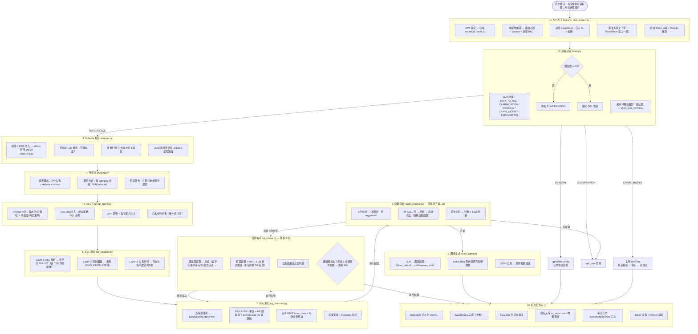

**关键设计决策**：

1. **流式不调 `run_agent()` 黑盒**：SSE 端点分步调 `deps.*`，每步后 yield 事件，前端实时渲染管线进度。同步端点 `POST /chat` 调 `run_agent()` 整体执行，保留向后兼容。
2. **自愈配额共享**：SQL 自愈 + 结果自检修正共享 `self_heal_rounds` 计数器（默认 2），总修正次数封顶，防无限循环。
3. **白名单列取整个语义层**：不限制为检索命中的表，避免 JOIN 关联表时列不在白名单误拒正确 SQL。
4. **不传原始 DB 错误给 LLM**：自愈 prompt 只用错误类别 + hint，防泄露跨租户 schema（如 `Table 'tenant_xxx.table' doesn't exist`）。

---

### 第三章 组件依赖关系

```mermaid
graph TB
    Main["main.py<br/>FastAPI 应用<br/>lifespan: 启动探测→建表→预热→调度器"]

    Main --> API["api/ 路由层"]
    Main --> Core["core/ 基础设施"]
    Main --> AI["ai/ Agent 引擎"]
    Main --> Svc["services/ 业务服务"]
    Main --> DB["db/ 持久化层"]

    API --> AI
    AI --> Svc
    Svc --> Core
    Core --> DB

    subgraph APIDetails["api/ — 12 个路由文件"]
        direction LR
        api_auth["auth.py 认证"]
        api_chat["chat.py 同步问答"]
        api_stream["chat_stream.py SSE 流式"]
        api_ds["data_sources.py 数据源"]
        api_sem["semantic_models.py 语义层"]
        api_dash["dashboard.py 看板"]
        api_graph["graph.py 图谱"]
        api_obs["observability.py 可观测性"]
        api_skills["skills.py 业务规则"]
        api_memory["memory.py Agent 记忆"]
    end

    subgraph AIDetails["ai/ — 14 个模块"]
        direction LR
        ai_agent["agent.py 状态机编排"]
        ai_intent["intent.py 意图识别"]
        ai_thinking["thinking.py 预思考"]
        ai_sqlgen["sql_agent.py SQL 生成"]
        ai_heal["sql_healer.py SQL 自愈"]
        ai_chart["chart_agent.py 图表生成"]
        ai_check["result_checker.py 结果自检"]
        ai_replier["replier.py 自然语言回复"]
        ai_ask["ask_user.py 用户澄清"]
        ai_recall["recall.py 记忆召回"]
        ai_compress["compressor.py 上下文压缩"]
        ai_state["state_store.py 状态管理"]
        ai_schema["schema_utils.py Schema 工具"]
    end

    subgraph SvcDetails["services/ — 16 个服务"]
        direction LR
        svc_embed["embedder.py BGE 嵌入"]
        svc_retr["retriever.py 两阶段检索"]
        svc_vec["vector_store.py 向量存储"]
        svc_sql["sql_executor.py SQL 执行"]
        svc_ds["datasource_engine.py 连接池"]
        svc_graph["graph_service.py 图谱"]
        svc_scan["semantic_scanner.py 扫描"]
        svc_kg["knowledge_graph.py 图谱推断"]
        svc_index["indexer.py 索引构建"]
        svc_few["fewshot.py Few-shot"]
    end

    subgraph CoreDetails["core/ — 18 个核心模块"]
        direction LR
        core_config["config.py 配置"]
        core_auth["auth.py JWT+RBAC"]
        core_sec["security.py 加密"]
        core_llm["llm_client.py LLM 客户端"]
        core_sqlval["sql_validator.py SQL 校验"]
        core_redis["redis_client.py Redis"]
        core_milvus["milvus_client.py Milvus"]
        core_sched["scheduler.py 调度器"]
        core_probe["startup_probe.py 启动探测"]
        core_token["token_tracker.py Token 追踪"]
    end

    API --> APIDetails
    AI --> AIDetails
    Svc --> SvcDetails
    Core --> CoreDetails
```

---

### 第四章 模块间调用关系

以 `chat.py` 为入口，展示一次问答的完整调用链：

```mermaid
flowchart LR
    subgraph ChatEndpoint["chat.py / chat_stream.py"]
        BuildDeps["build_agent_deps()"]
        RunAgent["run_agent()"]
        Persist["持久化链"]
    end

    subgraph DepsAssembly["AgentDeps 装配的 11 个依赖"]
        direction TB
        D1["VectorStore<br/>Milvus/Mock"]
        D2["SkillsLoader<br/>skills/{tenant_id}/"]
        D3["Embedder<br/>BGE 本地"]
        D4["Retriever<br/>两阶段检索"]
        D5["SQLExecutor<br/>连接池+超时"]
        D6["FewShot<br/>相似 SQL 检索"]
        D7["MemoryRecall<br/>Agent 记忆"]
        D8["DataSourceEngine<br/>动态连接池"]
    end

    subgraph AgentFlow["run_agent() 内部调用"]
        direction TB
        R1["classify_intent() → LLM"]
        R2["retrieve() → Embedder + VectorStore + LLM 精筛"]
        R3["think() → LLM"]
        R4["generate_sql() → LLM + FewShot + Skills + 记忆"]
        R5["execute_sql() → SQLExecutor 连接池"]
        R6["heal_sql() → LLM 自愈"]
        R7["check_result() → 纯规则同步"]
        R8["generate_chart() → LLM + 规则兜底"]
        R9["generate_reply() → LLM 回复"]
    end

    subgraph PersistChain["持久化链"]
        direction TB
        P1["StateStore.save() → JSONL"]
        P2["SavedQuery.save() → PostgreSQL"]
        P3["FewShot.index() → Milvus"]
        P4["MetricFeedback.persist() → co_occurrence"]
        P5["AuditLog.write() → PostgreSQL"]
        P6["TokenTracker.stop() → 内存"]
    end

    BuildDeps --> DepsAssembly
    BuildDeps --> RunAgent
    RunAgent --> AgentFlow
    RunAgent --> Persist
    Persist --> PersistChain
```

---

### 第五章 数据库模型关系（ER 图）

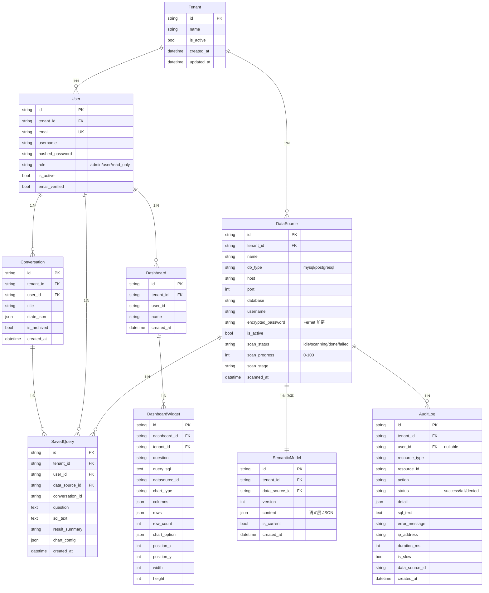

**关键设计**：
- **TenantMixin**：所有租户隔离表继承，含 `tenant_id` 字段 + `tenant_filter()` 类方法，查询时用 `.where(Model.tenant_filter(tid))` 显式过滤
- **SavedQuery 不设 UniqueConstraint**：question/sql_text 是 Text 列，btree 索引行超 2712 字节会失败，去重由应用层 SELECT-then-INSERT 保证
- **SemanticModel 版本唯一约束**：`UniqueConstraint("tenant_id", "data_source_id", "version")`
- **主键统一**：`String(32)` + `uuid.uuid4().hex`
- **时间统一**：`DateTime(timezone=True)` + `utcnow()`

---

### 第六章 向量存储结构

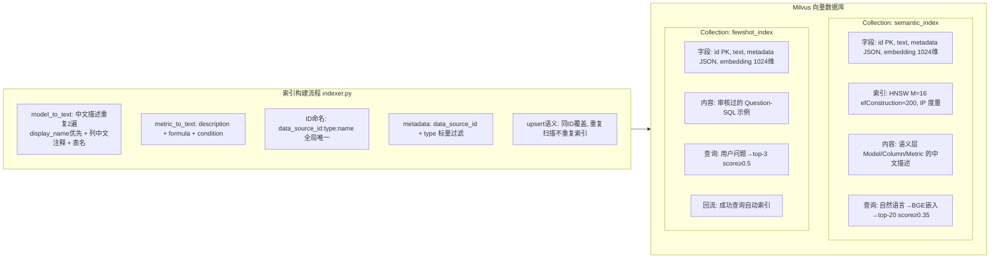

**关键设计**：
- **中文描述重复 2 遍**：BGE 对重复文本语义权重有叠加效果，2 遍是经验最佳值
- **data_type 不进文本**：对语义匹配无帮助，反增噪声
- **data_source_id 标量过滤**：多租户/多源隔离，防跨源召回
- **fewshot 独立 collection**：和 schema 索引分开，top-3 防 prompt token 爆炸
- **fewshot ID = md5(data_source_id:question)**：防同问题跨数据源覆盖

---

### 第七章 项目文件结构

```
chat-bi/
├── backend/app/                        # 后端核心代码
│   ├── main.py                         # FastAPI 入口 + lifespan
│   ├── api/                            # HTTP API 路由层（13 个文件）
│   │   ├── __init__.py                 # 路由聚合（12 个子路由）
│   │   ├── auth.py                     # 认证（注册/登录/刷新）
│   │   ├── dev_auth.py                 # 开发模式 token
│   │   ├── chat.py                     # 同步问答
│   │   ├── chat_stream.py              # SSE 流式问答
│   │   ├── data_sources.py             # 数据源 CRUD + 扫描
│   │   ├── semantic_models.py          # 语义层版本管理
│   │   ├── dashboard.py                # 看板 CRUD
│   │   ├── saved_queries.py            # 保存查询 + CSV 导出
│   │   ├── skills.py                   # 业务规则管理
│   │   ├── memory.py                   # Agent 记忆管理
│   │   ├── graph.py                    # 知识图谱 API
│   │   └── observability.py            # 可观测性
│   ├── ai/                             # Agent 执行引擎（14 个文件）
│   │   ├── agent.py                    # 状态机编排 run_agent()
│   │   ├── intent.py                   # 意图识别（5 分类）
│   │   ├── thinking.py                 # 预思考
│   │   ├── sql_agent.py                # SQL 生成
│   │   ├── sql_healer.py               # SQL 自愈
│   │   ├── chart_agent.py              # 图表生成
│   │   ├── result_checker.py           # 结果自检
│   │   ├── replier.py                  # 自然语言回复
│   │   ├── ask_user.py                 # 用户澄清
│   │   ├── recall.py                   # 记忆召回
│   │   ├── compressor.py              # 上下文压缩
│   │   ├── state_store.py              # 对话状态管理
│   │   ├── schema_utils.py             # Schema 工具
│   │   ├── chat_utils.py               # 共享工具
│   │   └── question_generator.py       # 示例问题生成
│   ├── core/                           # 基础设施层（18 个文件）
│   │   ├── config.py                   # 集中配置（Pydantic Settings）
│   │   ├── auth.py                     # JWT 鉴权 + RBAC
│   │   ├── security.py                 # 密码/加密/Token
│   │   ├── llm_client.py               # LLM 客户端（AsyncOpenAI）
│   │   ├── llm_json.py                 # JSON 解析工具
│   │   ├── sql_validator.py            # SQL 三层校验
│   │   ├── redis_client.py             # Redis 客户端
│   │   ├── milvus_client.py            # Milvus 客户端
│   │   ├── rate_limit.py               # 限流器
│   │   ├── logging.py                  # 日志配置
│   │   ├── checkpointer.py             # 检查点
│   │   ├── startup_probe.py            # 启动探测
│   │   ├── scheduler.py                # 定时任务
│   │   ├── token_tracker.py            # Token 追踪
│   │   ├── prompt_capture.py           # Prompt 捕获
│   │   ├── prompt_cache.py             # Prompt 缓存
│   │   ├── text_sanitize.py            # Unicode 清洗
│   │   └── agent_memory.py             # 文件记忆存储
│   ├── db/                             # 数据持久化层
│   │   ├── session.py                  # 异步引擎 + 自动建表
│   │   └── models.py                   # 10 张 ORM 模型
│   ├── schemas/                        # Pydantic 模型
│   │   └── semantic_layer.py           # 语义层 JSON Schema
│   └── services/                       # 业务服务层（16 个文件）
│       ├── embedder.py                 # BGE 向量嵌入
│       ├── retriever.py                # 两阶段检索
│       ├── vector_store.py             # 向量存储抽象
│       ├── milvus_vector_store.py      # Milvus 实现
│       ├── sql_executor.py             # SQL 执行器
│       ├── datasource_engine.py        # 数据源连接池
│       ├── datasource_health.py       # 数据源健康检查
│       ├── graph_service.py            # 知识图谱 NetworkX
│       ├── semantic_scanner.py         # 数据源扫描
│       ├── knowledge_graph.py          # 图谱推断演化
│       ├── semantic_diff.py            # 语义层差异比较
│       ├── metadata_refresher.py       # 元数据自动刷新
│       ├── indexer.py                  # 向量索引构建
│       ├── indexer_update.py           # 索引增量更新
│       ├── fewshot.py                  # Few-shot 检索
│       └── skills_loader.py            # Skills 加载器
├── frontend/src/                       # Vue 3 前端
│   ├── main.ts                         # 入口
│   ├── App.vue                         # 根组件 + 导航
│   ├── api/                            # HTTP 封装
│   ├── router/                         # 路由 + 导航守卫
│   ├── composables/                    # 组合式函数
│   ├── components/                     # 可复用组件
│   ├── views/                          # 9 个功能页面
│   └── utils/                          # 工具函数
├── skills/                             # 业务规则（SKILL.md）
├── memory/                             # Agent 记忆文件
├── data/                               # 运行时数据
├── docker/                             # Docker Compose
├── deploy/                             # 部署配置
├── doc/                                # 文档
│   ├── ChatBI v2 系统架构与学习指南.md  # 本文件
│   ├── 简历技术点与面试准备.md          # 简历 + 面试题
│   ├── chatbi-v2/                      # v2 方案文档
│   ├── Claude-Code-源码深度解读.md      # 设计法则来源
│   ├── 海泰ChatBI完整代码分析.md        # BI 领域打法来源
│   ├── 经验教训.md                      # v1 48 条坑
│   └── v1-archive/                     # v1 历史文档
├── .planning/                          # GSD 规划状态
├── openspec/                           # OpenSpec 规格
└── .claude/                            # Claude 配置
```

---

### 第八章 关键设计决策

| 决策 | 选择 | 替代方案 | 理由 |
|------|------|---------|------|
| AI 框架 | 自建 Agent 状态机 | LangGraph, DeepAgents | 确定性工作流，严格前向，非"Agent 失控"；依赖注入全链路可 mock；无框架黑盒 |
| 语义层 | MDL 风格 JSON Schema | 自然语言描述 | 结构化的 Schema Linking，准确率提升约 40% |
| 嵌入模型 | 本地 BGE-large-zh-v1.5 | 在线 API 嵌入 | 离线可用、维度确定（1024）、中文最优；讯飞非标准协议不可用 |
| 向量库 | Milvus | Chroma, Qdrant | 生产级、HNSW 索引、支持标量过滤（data_source_id 隔离） |
| SQL 校验 | sqlglot AST | 正则/字符串匹配 | 多方言、AST 级别安全；v1 字符串前缀检测被绕过（教训 #46） |
| 前端状态 | 组合式 API (ref) | Pinia/Vuex | 轻量、无需全局状态管理 |
| 多租户 | 共享表 + tenant_id | 独立库/独立 Schema | 运维成本低、适合 SaaS |
| 数据源密码 | Fernet 对称加密 | AES / KMS | 自包含、无需外部 KMS；需解密后连库所以用对称加密 |
| 启动探测 | 必需服务 fail-fast | 全部降级启动 | 安全 Fail-Closed；PG 是元数据真相源 |
| 对话持久化 | JSONL 文件 | PostgreSQL JSON | 追加写入性能好、无 Schema 变更（字段经常加）、POSIX append 原子 |
| 图算法 | NetworkX Dijkstra | 预计算所有路径 | weight = 1 - confidence 优先走外键路径，max_hops=4 防过长链 |
| 熔断器 | 三态 closed/open/half-open | 简单计数器 | 跨查询累积，cooldown 后自动试探恢复 |

---

### 第九章 安全架构

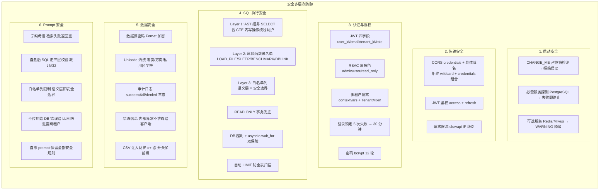

**核心原则 — Fail-Closed**：安全相关功能出问题拒绝而非放行。任何降级都要 WARNING + 告警。

**审计日志三层降级**（确保审计不丢）：
1. 优先：创建独立 db session，单独 commit（业务 rollback 不影响审计）
2. 降级：使用调用方传入的 db_session（业务 rollback 会丢审计，但写入成功）
3. 最终：`logger.error` 写入日志文件（至少文件级有记录）

---

### 第十章 Agent 状态机状态流转图

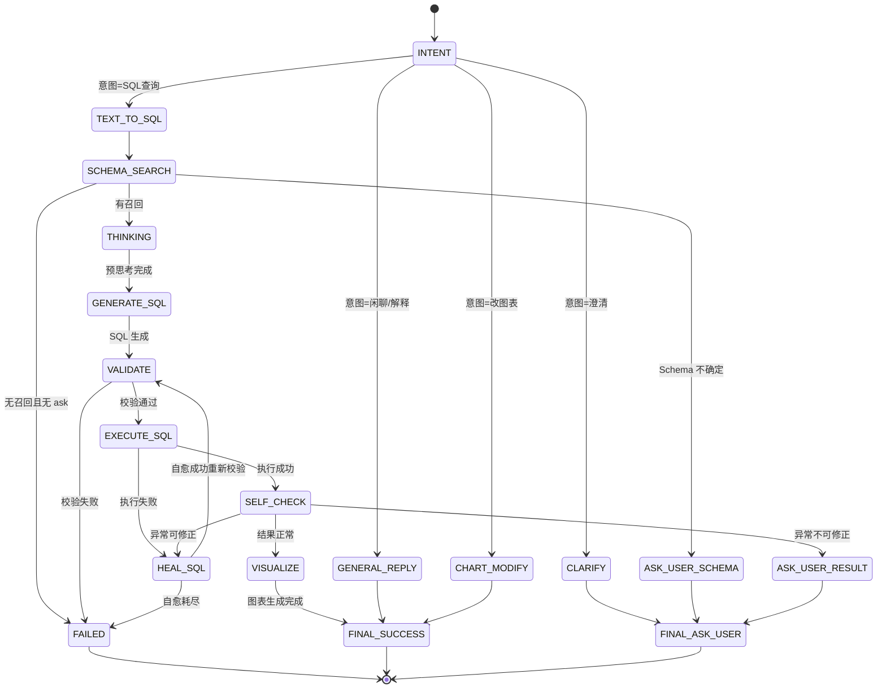

> **说明**：本状态机对应 `AgentStage` 枚举（`agent.py:31`）：`INTENT → SCHEMA_SEARCH → GENERATE_SQL → EXECUTE_SQL → SELF_CHECK → VISUALIZE → FINAL`。
> 其中 `THINKING`（预思考）、`VALIDATE`（SQL 校验）不是独立状态，而是 `GENERATE_SQL` 和 `EXECUTE_SQL` 中的函数调用。
> 自愈（`HEAL_SQL`）是 `EXECUTE_SQL` 内部的 while 循环，用 `self_heal_rounds` 计数器控制最多 2 轮。
> `SELF_CHECK` 的异常修正也消耗 `self_heal_rounds` 配额——SQL 自愈 + 结果自检修正共享同一个计数器，总修正次数封顶 2 次。

---

### 第十一章 代码引用索引（快速入口）

> 每个模块的完整代码引用索引见本文档「附录：代码引用索引」，以下是关键入口点的快速索引。

#### 核心入口

| 模块 | 文件 | 关键入口 |
|------|------|---------|
| 应用入口 | `backend/app/main.py:19` | `lifespan()` — 启动/关闭生命周期 |
| 应用工厂 | `backend/app/main.py:101` | `create_app()` — FastAPI 工厂 |
| 配置加载 | `backend/app/core/config.py:339` | `get_settings()` — 配置单例 |
| 配置校验 | `backend/app/core/config.py:344` | `validate_settings_on_startup()` — CHANGE_ME 拒绝启动 |
| 启动探测 | `backend/app/core/startup_probe.py:213` | `run_startup_probes()` — 必需服务 fail-fast |
| 自动建表 | `backend/app/db/session.py:122` | `auto_create_tables()` — 模型即真相源 |
| 路由聚合 | `backend/app/api/__init__.py:31` | `api_router` — 12 个子路由聚合 |

#### Agent 执行引擎

| 模块 | 文件 | 关键入口 |
|------|------|---------|
| 状态机编排 | `backend/app/ai/agent.py:123` | `run_agent()` — 主循环 |
| 意图识别 | `backend/app/ai/intent.py:123` | `classify_intent()` — 5 意图分类 |
| 预思考 | `backend/app/ai/thinking.py:78` | `think()` — SQL 生成前思考 |
| SQL 生成 | `backend/app/ai/sql_agent.py:113` | `generate_sql()` — Prompt 分层生成 |
| SQL 自愈 | `backend/app/ai/sql_healer.py:180` | `heal_sql()` — 错误分类 + 纠正 |
| 图表生成 | `backend/app/ai/chart_agent.py:584` | `generate_chart()` — LLM + 规则兜底 |
| 结果自检 | `backend/app/ai/result_checker.py:76` | `check_result()` — 纯规则检查 |
| 记忆召回 | `backend/app/ai/recall.py:27` | `recall_memories()` — 关键词检索 |
| 上下文压缩 | `backend/app/ai/compressor.py:119` | `compact_history()` — 压缩 + 状态补偿 |
| 状态管理 | `backend/app/ai/state_store.py:156` | `StateStore` — JSONL 持久化 |
| Schema 工具 | `backend/app/ai/schema_utils.py:61` | `get_schema_graph()` — 图谱构建 |
| 两阶段检索 | `backend/app/services/retriever.py:39` | `retrieve()` — 向量召回 + LLM 精筛 |

#### 业务服务

| 模块 | 文件 | 关键入口 |
|------|------|---------|
| 向量嵌入 | `backend/app/services/embedder.py:158` | `get_embedder()` — BGE 单例 |
| SQL 执行 | `backend/app/services/sql_executor.py:130` | `execute_sql()` — 连接池 + 超时 |
| 数据源连接池 | `backend/app/services/datasource_engine.py:73` | `DataSourceEnginePool` — 动态连接池 |
| 知识图谱 | `backend/app/services/graph_service.py:60` | `SchemaGraph` — NetworkX 图服务 |
| 数据源扫描 | `backend/app/services/semantic_scanner.py:64` | `scan_data_source()` — 扫描 → JSON |
| 图谱推断 | `backend/app/services/knowledge_graph.py:245` | `infer_knowledge_graph()` — 推断关系 |
| 索引构建 | `backend/app/services/indexer.py:100` | `build_index()` — 语义层 → 向量 |
| Few-shot | `backend/app/services/fewshot.py:37` | `find_fewshot_examples()` — 相似 SQL 检索 |
| Skills 加载 | `backend/app/services/skills_loader.py:84` | `SkillsLoader` — SKILL.md 解析 |
| 元数据刷新 | `backend/app/services/metadata_refresher.py:41` | `detect_and_refresh_metadata()` — 自动刷新 |

#### 基础设施

| 模块 | 文件 | 关键入口 |
|------|------|---------|
| LLM 客户端 | `backend/app/core/llm_client.py:90` | `llm_chat()` — 重试/退避/追踪 |
| SQL 校验 | `backend/app/core/sql_validator.py:109` | `validate_sql()` — 三层校验 |
| 认证鉴权 | `backend/app/core/auth.py:82` | `get_current_user()` — JWT 依赖 |
| 密码加密 | `backend/app/core/security.py:20` | `hash_password()` — bcrypt 12 轮 |
| Token 加密 | `backend/app/core/security.py:89` | `create_access_token()` — JWT 签发 |
| 审计日志 | `backend/app/core/auth.py:258` | `write_audit_log()` — 三态写入 |
| 限流器 | `backend/app/core/rate_limit.py:35` | `get_limiter()` — slowapi |
| 调度器 | `backend/app/core/scheduler.py:42` | `start_scheduler()` — 定时任务 |
| Token 追踪 | `backend/app/core/token_tracker.py:102` | `start_token_tracking()` — 请求级 |
| Prompt 捕获 | `backend/app/core/prompt_capture.py:76` | `start_prompt_capture()` — 调试用 |
| Unicode 清洗 | `backend/app/core/text_sanitize.py:31` | `sanitize_text()` — 安全清洗 |
| 文件记忆 | `backend/app/core/agent_memory.py:24` | `AgentMemoryStore` — .md 文件存储 |

#### API 端点

| 端点 | 文件 | 描述 |
|------|------|------|
| POST /chat | `backend/app/api/chat.py:322` | 同步问答 |
| POST /chat/stream | `backend/app/api/chat_stream.py:100` | 流式问答 (SSE) |
| POST /auth/register | `backend/app/api/auth.py:97` | 注册 |
| POST /auth/login | `backend/app/api/auth.py:199` | 登录 |
| POST /auth/refresh | `backend/app/api/auth.py:281` | 刷新 Token |
| POST /data-sources | `backend/app/api/data_sources.py:91` | 创建数据源 |
| POST /data-sources/{id}/scan | `backend/app/api/data_sources.py:274` | 触发扫描 |
| GET /semantic-models | `backend/app/api/semantic_models.py:49` | 获取语义层 |
| GET /dashboards | `backend/app/api/dashboard.py:191` | 看板列表 |
| GET /graph | `backend/app/api/graph.py:97` | 全量图谱 |
| GET /audit-logs | `backend/app/api/observability.py:52` | 审计日志 |
| GET /skills | `backend/app/api/skills.py:105` | Skills 列表 |
| GET /memory | `backend/app/api/memory.py:170` | 记忆列表 |

#### 前端页面

| 页面 | 文件 | 关键方法 |
|------|------|---------|
| 对话问答 | `frontend/src/views/ChatView.vue:880` | `send()` — 流式发送 |
| 数据源管理 | `frontend/src/views/DataSourceView.vue:154` | `fetchList()` — 加载列表 |
| 语义层编辑 | `frontend/src/views/SemanticView.vue:382` | `fetchData()` — 加载语义层 |
| 看板管理 | `frontend/src/views/DashboardView.vue:125` | `loadDashList()` — 加载看板 |
| 历史记录 | `frontend/src/views/HistoryView.vue:133` | `loadAudit()` — 审计日志 |
| 系统监控 | `frontend/src/views/ObservabilityView.vue:198` | `loadMetrics()` — 指标 |
| 记忆管理 | `frontend/src/views/MemoryView.vue:424` | `fetchData()` — 记忆列表 |
| 业务规则 | `frontend/src/views/SkillsView.vue:206` | `fetchData()` — Skills 列表 |
| 图谱组件 | `frontend/src/components/SchemaGraph.vue:376` | `initG6()` — G6 初始化 |

---

### 第十二章 Java 开发者速查指南

> 如果你是从 Java/Spring Boot 背景转过来的开发者，这份指南帮你快速建立概念映射。

#### 12.1 技术栈对照表

| Python / ChatBI | 类比 Java 技术 | 关键差异 |
|----------------|---------------|---------|
| **FastAPI** | Spring Boot + Spring Web | 路由用装饰器 `@app.get()` 而非注解；原生异步；自动生成 OpenAPI 文档 |
| **Pydantic** | Jackson + Hibernate Validator | 用类型注解同时做校验和序列化，一体两面 |
| **SQLAlchemy async** | JPA / Hibernate + R2DBC | Session ≈ EntityManager，Model ≈ @Entity，但异步 API 更接近 R2DBC |
| **uv** | Maven / Gradle | `uv sync` ≈ `mvn install`，`uv run` ≈ `mvn exec:java`，`uv add` ≈ `mvn dependency:add` |
| **pyproject.toml** | pom.xml / build.gradle | 项目配置 + 依赖声明，但用 TOML 格式而非 XML |
| **.env** | application.yml | 环境变量驱动，`KEY=VALUE` 格式，没有 YAML 层次结构 |
| **pytest** | JUnit 5 | 函数级测试 `def test_xxx():` 而非注解；`assert` 语句而非 `assertEquals()` |
| **APScheduler** | Spring @Scheduled / Quartz | 编程式注册任务，类似 `scheduler.add_job(func, 'interval', minutes=5)` |
| **SQLGlot** | JSqlParser / 通用 SQL 解析器 | 解析 SQL 为 AST，支持多方言转换 |
| **NetworkX** | JGraphT / Guava Graph | Python 图分析库，支持 Dijkstra、社区发现等 |
| **Milvus** | Elasticsearch（向量版） | 存向量而非文本，用 HNSW 索引而非倒排索引 |
| **Redis** | Redis（Java 也有） | 完全一样，缓存/限流/会话管理 |
| **PostgreSQL** | PostgreSQL（Java 也有） | 完全一样，但连接用 asyncpg 驱动 |

#### 12.2 Python 语法速查表（Java 开发者版）

| Python 语法 | Java 类比 | 说明 |
|------------|----------|------|
| `def func():` | `void func()` | 函数定义，根级别不需要类 |
| `async def func():` | `CompletableFuture<Void> func()` | 异步函数，用 await 调用 |
| `await func()` | `func().get()` | 等待异步结果 |
| `class X:` | `class X { }` | 类定义，不需要 `public class` |
| `class X(Base):` | `class X extends Base { }` | 继承 |
| `self.xxx` | `this.xxx` | 实例引用，必须显式声明为第一个参数 |
| `@dataclass` | `@Data` (Lombok) / `record` | 自动生成构造器、toString、equals |
| `@property` | `@Getter` | 把方法变成属性访问 |
| `X \| None` | `Optional<X>` | 可选类型，Python 3.10+ 语法 |
| `x: int = 5` | `int x = 5` | 类型注解（运行时不强制） |
| `from x import y` | `import x.y` | 导入模块中的特定项 |
| `try: ... except E as e:` | `try { } catch (E e) { }` | 异常处理，没有 checked exception |
| `with open(f) as fh:` | `try (FileReader fr = new FileReader(f))` | 自动资源管理 |
| `[x*2 for x in list]` | `list.stream().map(x -> x*2).toList()` | 列表推导式 |
| `lambda x: x*2` | `x -> x * 2` | Lambda 表达式 |
| `@decorator` | 注解（但更强大） | 装饰器，可以包装函数/类 |
| `__init__.py` | `package com.example;` | 标识目录为 Python 包，Java 不需要 |
| `if __name__ == '__main__':` | `public static void main(String[] args)` | 入口点判断 |
| `yield` | `return` + 状态保留 | 生成器，逐个产生值，可恢复状态 |

#### 12.3 关键 Python 概念详解

**1. `async def` / `await`（异步编程）**
```python
# Python 的 async/await 类似于 Java 的 CompletableFuture
async def fetch_data():                # 相当于 CompletableFuture<Data> fetchData()
    result = await db.query(sql)       # 相当于 db.query(sql).get()
    return result                      # 相当于 CompletableFuture.completedFuture(result)
```
- 但 Python 的协程更轻量：不需要线程池，单线程内并发
- 类比：Java 的虚拟线程（Virtual Threads）+ CompletableFuture 的合体

**2. `@dataclass`（数据类）**
```python
@dataclass
class User:                            # 相当于 @Data class User
    id: str                            # private String id;
    name: str                          # private String name;
    age: int = 0                       # private int age = 0;
```
- 自动生成：`__init__`（构造器）、`__repr__`（toString）、`__eq__`（equals/hashCode）

**3. `Protocol`（鸭子类型接口）**
```python
class Embedder(Protocol):              # 相当于 interface Embedder
    async def embed(self, texts): ...  #     CompletableFuture<List<float[]>> embed(List<String> texts);
```
- 不需要显式 `implements`——任何有同名方法的对象自动实现 Protocol
- 类比：Java 的 `interface` + 泛型，但更灵活（结构类型而非名义类型）

**4. `contextvars`（异步上下文）**
```python
_tenant_id = contextvars.ContextVar('tenant_id')  # 相当于 ThreadLocal<String>
def set_current_tenant(tid: str):                 # public static void setCurrentTenant(String tid)
    _tenant_id.set(tid)
```
- 类比 Java 的 ThreadLocal，但在异步代码中安全（同一协程内保持）
- 类似 Java 的 `TransmittableThreadLocal`（阿里开源，解决线程池传递问题）

#### 12.4 关键架构概念详解

**什么是 Agent？**
```
AI Agent ≠ Spring Agent ≠ JMX Agent

这里的 Agent 是一个"LLM 驱动的工作流引擎"。可以理解为：
- 一个"智能 Service 层"，接收用户问题，输出 SQL 和图表
- 内部有状态机控制执行流程
- 可以自我修正（SQL 错了就重试）
- 可以问用户（不确定时暂停等待输入）

类比 Java：最接近 Spring State Machine + 策略模式
但每个"状态"的执行逻辑是调用 LLM API，而不是 Java 方法
```

**什么是 LLM（大语言模型）？**
```
LLM = Large Language Model，如 GPT-4、Claude、Qwen 等。
可以理解为"一个超级智能的实习生"：
- 你给它一段文字（Prompt），它续写出一段文字（Response）
- 它不是 API 接口，不是算法，而是"猜下一个词"的神经网络

系统调用 LLM 的方式：
- 是调用 llm_chat() 函数，传入 prompt，返回文本
- 类似于调用一个"超级 String → String 函数"
```

**什么是 Embedding / 向量？**
```
Embedding（嵌入）是把文本变成数字向量的过程。
类似于 MD5 哈希，但 MD5 保证"相同输入→相同输出"，
Embedding 保证"语义相似→数字距离近"。

"狗"  → [0.1, 0.3, 0.8, ...]  (1024 个数字)
"猫"  → [0.2, 0.3, 0.7, ...]  (距离近，因为语义相似)
"汽车" → [0.9, 0.1, 0.2, ...]  (距离远，因为语义不相似)

BGE-large-zh-v1.5 是专门做中文嵌入的模型，输出 1024 维向量。
```

**什么是向量数据库？**
```
传统数据库：SELECT * FROM users WHERE name = '张三' → 精确匹配
向量数据库：SELECT * ORDER BY distance(query_vec) LIMIT 10 → 相似度搜索

类比：向量数据库 ≈ Elasticsearch 的"更像这份"（More Like This）查询
Milvus 是开源的向量数据库，类似 ES 但用于向量
```

**什么是 self-healing（自愈）？**
```
SQL 自愈不是"自己修复自己"，而是：
1. 生成 SQL → 执行 → 报错（如"列不存在"）
2. 分析错误信息（错误分类 + hint，不传原始 DB 错误防泄露）
3. 带着错误类别重新调用 LLM 生成修正版 SQL
4. 重新校验 → 重新执行 → 最多 2 轮

类比 Java：
try { execute(sql); } catch (SQLException e) {
    // 分析错误，调 LLM 修正 SQL，重试（最多 2 次）
}
```

#### 12.5 快速启动指南（从零开始）

```bash
# 1. 安装 Python 3.12（如已安装可跳过）
#    macOS: brew install python@3.12
#    建议用 pyenv 管理版本（类似 Java 的 SDKMAN!）

# 2. 安装 uv（Python 包管理器，类比 Maven）
#    macOS/Linux: curl -LsSf https://astral.sh/uv/install.sh | sh

# 3. 克隆项目并安装依赖
git clone <repo-url>
cd chat-bi
uv sync                    # 相当于 mvn install（安装所有依赖）

# 4. 配置环境变量
cp backend/.env.example backend/.env
# 编辑 backend/.env 填写：LLM_URL、LLM_API_KEY、DATABASE_URL 等

# 5. 启动基础设施（Docker Compose）
docker compose up -d       # 启动 PostgreSQL + Milvus + Redis

# 6. 启动后端
./start-backend.sh         # 相当于 mvn spring-boot:run

# 7. 启动前端（另一个终端）
cd frontend
npm install
npx vite --host 0.0.0.0 --port 5173

# 8. 打开浏览器访问 http://localhost:5173
```

#### 12.6 调试技巧

```bash
# 查看日志（相当于 tail -f application.log）
tail -f logs/chatbi.log

# 用 print 调试（相当于 System.out.println）
# 在代码中加入: print(f"xxx = {xxx}")

# 用 pdb 断点调试（相当于手动插入断点）
# 在代码中加入: import pdb; pdb.set_trace()

# 用 IDE 调试：VS Code 或 PyCharm
./start-backend.sh --reload

# 跑测试（相当于 mvn test）
uv run pytest backend/tests/ -q

# 跑单个测试文件
uv run pytest backend/tests/test_intent.py -v
```

#### 12.7 常见误区

| 误区 | 正确理解 |
|------|---------|
| "Python 没有类型" | Python 有类型注解（`x: int`），但运行时不做强制检查 |
| "`__init__` 是构造器" | 是，但第一个参数是 `self`（实例引用） |
| "`@dataclass` 像 Lombok" | 类似，但 dataclass 是标准库，不需要插件 |
| "Python 的多线程" | 有 GIL 锁，多线程不能并行 CPU 计算，但异步 I/O 高效 |
| "`async def` 像 `@Async`" | 更底层，是协程而非线程池 |
| "Python 没有接口" | 有 `Protocol`（鸭子类型接口）和 `ABC`（抽象基类） |
| "`import` 像 Java 的 import" | Java 编译时静态导入，Python 运行时执行导入的代码 |

---

### 第十三章 关键实现深度解析

> 本章基于源码深度分析，补充架构图的实现细节。每个小节对应一个核心技术模块。

#### 13.1 Agent 状态机详解（`agent.py`）

`run_agent()` 的核心是严格前向状态机 + 唯一回环（自愈循环）。`AgentState` dataclass 包含：

- **阶段流转**：`stage`、`success`、`error`
- **中间产物**：`intent_output`、`retrieved_models`、`schema_context`、`thinking`、`sql`、`execute_result`、`chart_option`、`reply`
- **计数器**：`llm_call_count`、`self_heal_rounds`（自愈 + 自检修正共享）
- **降级标记**：`degraded`、`error_is_internal`（True=内部异常不发给客户端，False=业务错误可发）
- **追问继承**：`prev_sql`、`prev_tables`、`seed_tables`、`expanded_tables`、`join_path_section`

**自愈循环伪代码**：
```python
while last_error is not None and state.self_heal_rounds < deps.max_self_heal_rounds:
    state.self_heal_rounds += 1
    heal_result = await deps.heal_sql(sql, last_error, ...)
    if heal_result.error and not heal_result.sql:
        return final(failed, error_is_internal=True)  # 自愈失败
    # 自愈结果走同样三层校验（v1 教训 #32）
    validation = validate_sql(heal_result.sql, allowed_columns)
    if validation.ok:
        execute_result = await deps.execute_sql(heal_result.sql, ...)
        last_error = execute_result.error
    # 仍有错 → 继续循环（耗尽配额退出）
```

**结果自检修正回路**（AEE-003）：
```python
check = deps.check_result(execute_result, sql)  # 纯规则不调 LLM
if not check.ok and check.suggestion and state.self_heal_rounds < deps.max_self_heal_rounds:
    state.self_heal_rounds += 1  # 消耗共享配额
    heal_result = await deps.heal_sql(sql, check.suggestion, ...)  # 用自检建议作纠正方向
    # 重新执行 + 复检
```

#### 13.2 意图识别详解（`intent.py`）

5 种意图：`TEXT_TO_SQL`（完整管道）、`CLARIFICATION`（无法确定查什么）、`GENERAL`（闲聊）、`CHART_MODIFY`（只改图表）、`EXPLANATION`（解释已有 SQL）。

**降级链**：
1. LLM 返回非法 JSON → 重试（最多 `MAX_RETRIES=2` + 1 次）
2. LLM 调用网络失败 → 直接降级不重试（网络问题重试无用）
3. 重试耗尽 → 降级 `CLARIFICATION`（confidence=0.0）
4. `confidence < 0.6` → 降级 `CLARIFICATION`（标 `CONFIDENCE_DEGRADE_THRESHOLD`）

**关键设计**：始终返回不抛异常。降级时保留 `normalized_question` 和 `chart_type_hint`，不丢失用户意图。

#### 13.3 SQL 生成 Prompt 分层详解（`sql_agent.py`）

使用 `PromptCache` 全局单例，`assemble()` 返回 `[static..., BOUNDARY, dynamic...]`：

**静态层**（可缓存，TTL 5 分钟，MD5 内容哈希，命中 LLM prefix cache）：
- `system_rules`：6 条严格规则（SELECT only / 白名单列 / data_type 约束 / 危险函数禁用 / 只返回 SQL / AS 中文别名）

**动态层**（每次重算，不跨数据源泄漏白名单）：
- `schema_type`：schema 与类型约束
- `allowed_cols`：白名单列约束（取整个语义层全部列）
- `join_path`：图驱动 JOIN 路径块
- `metrics_hint`：业务指标定义
- `context`：few-shot + skills + thinking_hint + history + question

**白名单列取整个语义层的 WHY**：`retrieved_names` 只影响 `schema_context` 提示，若限制白名单则 JOIN 一个未命中的关联表时其列不在白名单会误拒正确 SQL。

#### 13.4 SQL 自愈详解（`sql_healer.py`）

**错误码映射**（MySQL 风格数字码）：
- `1146`/`1051` → TABLE_NOT_EXIST
- `1054`/`1166` → COLUMN_NOT_EXIST
- `1064`/`1149` → SYNTAX_ERROR
- `1052`/`1060` → AMBIGUOUS_COLUMN
- `1066` → DUPLICATE_TABLE_ALIAS
- PG 无数字码 → UNKNOWN 从文字推断

**熔断器三态**：
- `closed`：正常，记录失败/成功
- `open`：连续失败 >= 3 次（`sql_self_heal_circuit_breaker`），拒绝自愈不调 LLM
- `half-open`：open 后过 60 秒（`cooldown_seconds`），允许一次试探

**安全关键**（v1 教训 #32）：自愈 prompt 必须保留全部安全规则（`_SECURITY_RULES` 6 条），不传原始 DB 错误给 LLM（防泄露跨租户 schema），只用错误类别 + hint。

#### 13.5 两阶段检索详解（`retriever.py`）

**阶段 1 向量召回**：
- `rag_vector_top_k = 20`，`rag_similarity_threshold = 0.35`
- 注意：0.35 不是文档注释里的 0.5——BGE 中文分数分布偏低，0.5 会漏召回
- `data_source_id` 标量过滤防跨源召回
- embed 失败 → 返回空结果 + `no_match_reason`，不 fallback

**阶段 2 LLM 精筛**：
- 角色："你是 BI 数据库 Schema Linking 专家"
- 四条规则：① 找到核心表必须返回，哪怕只 1 张；② 多表问题尽量全选，但只确信 1 张就只返回 1 张；③ 所有候选都与问题无关时才返回空数组（宁缺毋滥）；④ 不要只选 score 最高的
- `temperature=0.0`，返回 JSON `{"models": ["name列表"], "reason": "简短理由"}`
- LLM 返回非法 JSON → 降级返回原始召回，标记 `degraded=True`

#### 13.6 SQL 执行详解（`sql_executor.py`）

**超时双保险**：
1. DB 侧（更可靠）：PostgreSQL `SET LOCAL statement_timeout` / MySQL `SET SESSION max_execution_time` / SQLite 无 DB 侧超时
2. Python 侧：`asyncio.wait_for` 兜底（Python 无法取消线程，但 DB 能取消查询）

**自动 LIMIT**：用 sqlglot AST 判断**顶层**是否有 Limit（不用字符串检测），无则加 `LIMIT (max_rows + 1)`（多取 1 行用于截断检测）。

**READ ONLY 事务**：`SET TRANSACTION READ ONLY`——即使校验被绕过也不能写。

#### 13.7 图表生成三策略降级链（`chart_agent.py`）

1. **LLM 生成图表配置**（只返回 chart_type/dim_col/measure_cols，不填数据）
2. **JSON 自愈**（`heal_json`）：LLM 受 max_tokens 截断 → 数括号差值补右括号
3. **规则推断降级**（`infer_chart_by_rule`）：analyze_data_shape 自动识别维度/数值列

**关键决策：LLM 只决策不填数据**。`inject_data` 系统侧用完整 rows 程序化构建 ECharts option——图表始终含全量数据，不受 LLM 只看 5 行摘要的限制。

**规则推断优先级**：单值汇总→KPI / 不适合→table / 时间维度→line / 占比列→pie / 默认→bar。`_NUMERIC_COL_THRESHOLD=0.8`：非 None 值有 80% 是数值型才算数值列。

#### 13.8 上下文压缩与状态补偿（`compressor.py` + `state_store.py`）

**触发条件**：`current_tokens > model_limit * 0.70`（留 30% 给 SQL 输出）

**压缩逻辑**：
- 不够长（`len <= keep_recent*2`）→ 不压缩直接返回
- 分割：旧轮次 + 最近 `compression_keep_recent_turns=3` 轮（按条数切分）
- 旧轮次每条截断 200 字符防摘要 prompt 过长
- LLM 生成一句话摘要（保留查了什么表/指标/筛选/结果数字）
- 失败降级：丢弃旧轮次只保留 recent_messages（信息损失但可用）

**状态补偿**：压缩后从最后一轮 `ConversationState` 提取——语义层用到的表 + 当前 SQL[:300] + 筛选 + 上轮结果行数。

**token 估算不用 tiktoken 省依赖**：中文每字 ~1.5 token，非中文 ~4 字符/token，±20% 误差不影响 70% 阈值决策。

**压缩熔断器**：`threshold=3`，`cooldown=120s`（比 SQL 自愈熔断器 60s 长，因压缩本身调 LLM 持续失败浪费 API）。

#### 13.9 知识图谱详解（`graph_service.py` + `knowledge_graph.py`）

**SchemaGraph 基于 NetworkX DiGraph**：
- 节点 = 表名，边 = Relationship（双向边：forward + reverse）
- 同一对 (source, target) 只保留 confidence 更高的边（FK 优先于 name_pattern）

**Dijkstra 权重 = 1 - confidence**：confidence 越高 weight 越小，优先走 FK=1.0 路径。`max_hops=4` 防过长链。

**表扩展三阶段**：
1. 种子表间最短路径（补齐 JOIN 中间表）— 最精准
2. 邻居扩展（按图距离排序，近的优先，受 `rag_max_schema_tables=10` 控制）— 防超级枢纽占名额
3. 社区补全兜底（按到种子表图距离排序）— 受 `graph_expand_use_community` 开关控制

**关系推断**：
- name_pattern：`xxx_id` → 找表名 `<prefix>xxx` 或 `xxx`，confidence=0.6
- LLM 批量推断：confidence=0.7，200 表以内一次性发送，超过分批 100
- 置信度更新：频繁 JOIN（≥3 次）+0.1，纠正 -0.15，点赞 +0.05，范围 [0.1, 0.95]

#### 13.10 数据源扫描流程（`semantic_scanner.py`）

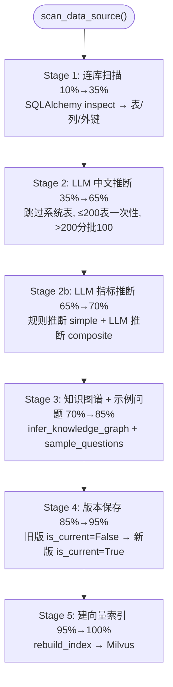

**语义类型推断**：primary_key→key / 数值类型→measure（纯外键整型→key）/ 其他→dimension

**source/confidence 标注**：有注释→manual(1.0) / 外键→foreign_key(1.0) / LLM→auto_inferred(0.8) / 退化列名→auto_inferred(0.5)

#### 13.11 配置管理详解（`config.py`）

所有魔法数字集中管理，环境变量驱动，关键配置：

| 分组 | 关键配置 | 默认值 |
|------|---------|--------|
| SQL 执行 | `sql_execution_timeout` / `sql_max_rows` / `sql_slow_query_threshold` | 30s / 10000 / 10.0s |
| 自愈 | `sql_self_heal_max_rounds` / `sql_self_heal_circuit_breaker` | 2 / 3 |
| RAG | `rag_vector_top_k` / `rag_similarity_threshold` / `rag_max_schema_tables` | 20 / 0.35 / 10 |
| 压缩 | `compression_token_threshold` / `compression_keep_recent_turns` | 0.70 / 3 |
| 图谱 | `graph_max_join_path_hops` / `graph_community_algorithm` | 4 / label_propagation |
| LLM | `llm_max_tokens` / `llm_timeout` / `llm_max_retries` | 262144 / 600s / 3 |
| 安全 | `bcrypt_rounds` / `max_login_attempts` / `login_lock_minutes` | 12 / 5 / 30 |

**CHANGE_ME 校验**：critical（DATABASE_URL/SECRET_KEY/FERNET_KEY/LLM_URL/LLM_MODEL/LLM_API_KEY 缺失拒绝启动）+ warning（REDIS_URL/MILVUS_URL 缺失降级）。

**数值范围校验**：大量 `@field_validator` 确保值在合理范围（如 `sql_execution_timeout: 1~300s`、`bcrypt_rounds: 4~20`），校验失败拒绝启动（fail-closed）。

#### 13.12 SSE 流式详解（`chat_stream.py`）

**11 种事件类型**：

| 序号 | 事件 | 携带数据 | 说明 |
|------|------|----------|------|
| 1 | `start` | conversation_id | 立刻发，本地 LLM 慢，前端尽早拿到 conv_id |
| 2 | `intent` | intent, duration_ms, node_usage | GENERAL 时含 reply 并结束 |
| 3 | `thinking` | tables, aggregation, caveats, seed_tables, expanded_tables | 预思考 + 图谱扩展 |
| 4 | `schema` | tables, metric_hits, duration_ms | schema 检索命中表 |
| 5 | `sql` | sql, fewshot_count, metric_hits, duration_ms | SQL 生成 |
| 6 | `heal`（可选） | retry, success, sql, before_sql, error | 自愈前后对比 |
| 7 | `data` | columns, rows, row_count, truncated, duration_ms | 执行结果（可多次发） |
| 8 | `clarify`（可选） | question, reason, options | ask_user 主动确认 |
| 9 | `chart` | option, duration_ms | 图表 ECharts option |
| 10 | `persist_warning`（可选） | stage, error, conversation_id | 反哺失败（Fail-Closed 不静默） |
| 11 | `complete` | success, conversation_id, error, token_usage, degraded, metric_hits | 结束 |

**骨架行持久化**：start 时落骨架行（只有问题无 sql），防中途刷新/断流丢失提问记录；末尾 `_persist` 复用骨架 turn 号避免重复轮次。

**持久化单一出口**：`_persist` 在 `finally` 统一执行一次，避免遗漏/重复。含 StateStore → SavedQuery → FewShot → 记忆提取 → 链路沉淀 → 指标反哺 → 审计日志完整链。

---

## 第二部分：学习路线图

### 学习路径总览

> **前置知识**: 熟悉 Python 基础语法、了解 SQL 基本查询、了解 REST API 概念。
> **目标**: 能读懂并修改代码即可，不要求全栈精通。
> **时间说明**: 以下时间为"从零到能读代码"的估算，实际取决于个人基础。


---

### 阶段一：项目背景与产品定位（预计 1-2 天）

#### 学习目标
理解 ChatBI 的产品定位、核心价值、以及与竞品的差异。

#### 必读文档

| 文档 | 路径 | 内容 | 阅读时长 |
|------|------|------|---------|
| **项目概览** | `doc/v1-archive/项目概览.md` | 产品核心价值、技术栈、架构决策 | 30 分钟 |
| **Proposal** | `doc/chatbi-v2/proposal.md` | 为什么要做 v2、5 条设计法则、P0/P1/P2 目标 | 10 分钟 |
| **Design** | `doc/chatbi-v2/design.md` | 技术栈、Leader-Worker 架构、Agent 执行流程 | 15 分钟 |
| **需求文档 v2** | `doc/需求文档-v2.md` | v2 需求清单 | 20 分钟 |
| **INDEX** | `doc/chatbi-v2/INDEX.md` | 所有文档的索引和阅读顺序 | 2 分钟 |
| **CLAUDE.md** | `CLAUDE.md` | 项目说明、设计法则、开发规范 | 5 分钟 |

#### 核心概念

- **NL2SQL (Natural Language to SQL)**: 自然语言转 SQL，产品的核心能力
- **语义层 (Semantic Layer)**: 数据库表结构的中文描述层，解决 Schema Linking 准确率问题
- **Agent 循环**: 不是一次 LLM 调用，而是"生成→校验→执行→自愈→自检→修正→再生成"的 while(true) 循环
- **Fail-Closed**: 安全默认是"否"，出问题时显式失败，绝不静默放行

#### 验证方法

读完这阶段后，你应该能回答：
1. ChatBI 解决什么核心问题？目标用户是谁？
2. v2 的 5 条设计法则是什么？
3. 为什么需要语义层而不是直接用 LLM 理解数据库？
4. 竞品分析中，WrenAI 做得对的地方和踩过的坑分别是什么？

#### 动手练习

1. 阅读 `doc/chatbi-v2/proposal.md`，对比 v1 和 v2 的核心差异
2. 阅读 `doc/经验教训.md`，找出 3 条你认为最重要的教训并记下来

---

### 阶段二：技术栈基础（预计 7-14 天，按需学习）

> ⚠️ 不要求精通全部技术栈，目标是"能读懂代码"。建议优先学习加粗标注的核心技术，其余遇到时再查文档。

#### 学习目标
掌握 ChatBI 使用的核心技术栈，能够阅读和理解代码。

#### 后端技术栈

| 技术 | 用途 | 学习资源 | 预估时间 |
|------|------|---------|---------|
| **Python 3.12** | 开发语言 | 官方教程 | 1 天（熟悉即可） |
| **FastAPI** | Web 框架 | [FastAPI 官方教程](https://fastapi.tiangolo.com/tutorial/) | 2 天 |
| **SQLAlchemy async** | ORM | [SQLAlchemy 2.0 教程](https://docs.sqlalchemy.org/en/20/orm/quickstart.html) | 2 天 |
| **Pydantic v2** | 数据校验 | [Pydantic 官方文档](https://docs.pydantic.dev/latest/) | 1 天 |
| **sqlglot** | SQL 解析 | [SQLGlot GitHub](https://github.com/tobymao/sqlglot) | 1 天（了解即可） |
| **APScheduler** | 定时任务 | [APScheduler 文档](https://apscheduler.readthedocs.io/) | 半天 |
| **NetworkX** | 图算法 | [NetworkX 教程](https://networkx.org/documentation/stable/tutorial.html) | 1 天 |

> **注意**：v1 文档提到 LangGraph，但 v2 实际是**自建 Agent 状态机**，不是 LangGraph。不需要学 LangGraph。

#### 数据存储技术

| 技术 | 用途 | 学习资源 | 预估时间 |
|------|------|---------|---------|
| **PostgreSQL** | 元数据库 | [PG 官方教程](https://www.postgresql.org/docs/current/tutorial.html) | 1 天 |
| **Milvus** | 向量数据库 | [Milvus 入门](https://milvus.io/docs/overview.md) | 1 天 |
| **Redis** | 缓存/限流 | [Redis 教程](https://redis.io/docs/getting-started/) | 1 天 |
| **BGE-large-zh** | 中文嵌入模型 | [BGE 模型介绍](https://github.com/FlagOpen/FlagEmbedding) | 半天 |

#### 前端技术栈

| 技术 | 用途 | 学习资源 | 预估时间 |
|------|------|---------|---------|
| **Vue 3 + TypeScript** | 前端框架 | [Vue 3 官方教程](https://vuejs.org/guide/introduction.html) | 3 天 |
| **Element Plus** | UI 组件库 | [Element Plus 文档](https://element-plus.org/zh-CN/) | 1 天 |
| **ECharts** | 图表库 | [ECharts 教程](https://echarts.apache.org/handbook/zh/get-started/) | 1 天 |
| **G6 v5** | 图可视化 | [G6 文档](https://g6.antv.antgroup.com/) | 1 天 |
| **GridStack** | 拖拽布局 | [GridStack 文档](https://github.com/gridstack/gridstack.js) | 半天 |
| **ExcelJS** | Excel 导出 | [ExcelJS GitHub](https://github.com/exceljs/exceljs) | 半天 |

#### 关键参考文档

| 文档 | 路径 | 内容 |
|------|------|------|
| **Claude Code 源码深度解读** | `doc/Claude-Code-源码深度解读.md` | 3043 行完整分析，设计法则来源 |
| **海泰 ChatBI 完整代码分析** | `doc/海泰ChatBI完整代码分析.md` | 24 个文件的逐行解析，BI 领域打法 |
| **经验教训** | `doc/经验教训.md` | v1 的 48 条坑，别重蹈覆辙 |

---

### 阶段三：系统架构（预计 1-2 天）

#### 学习目标
理解 ChatBI v2 的分层架构、模块划分和模块间依赖关系。

#### 必读文档

| 文档 | 路径 | 内容 |
|------|------|------|
| **架构图** | 本文档「第一部分：系统架构」第一章 | 整体架构总览 |
| **Design** | `doc/chatbi-v2/design.md` | 核心架构设计 |

#### 体系结构速览

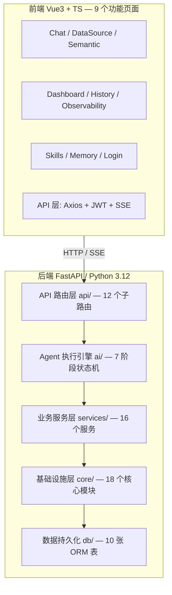

#### 验证方法

1. 画一张系统架构图（不用看文档，自己默画）
2. 说出每个层的职责和关键模块
3. 说出 API 层 → Agent 层 → 服务层 → 基础设施层的调用链

#### 动手练习

1. 运行 `uv run pytest backend/tests/ -q`，确认 700+ 测试全部通过
2. 查看 `backend/app/core/config.py`，找出所有 CHANGE_ME 占位符配置项
3. 阅读 `backend/app/main.py`，画出 lifespan 的启动流程图

---

### 阶段四：核心数据流（预计 1-2 天）

#### 学习目标
深刻理解"一次问答"的完整旅程，从用户输入到最终响应的全过程。

#### 必读文档

| 文档 | 路径 | 内容 |
|------|------|------|
| **架构图** | 本文档「第二章 核心数据流」 | 完整 Mermaid 流程图 |
| **Agent 执行引擎 Spec** | `doc/chatbi-v2/specs/agent-execution-engine/spec.md` | 详细 Agent 设计 |
| **agent.py** | `backend/app/ai/agent.py` | 源码级理解 |

#### 一问一答的完整旅程

以「各品类本月销售额，用柱状图展示」为例：

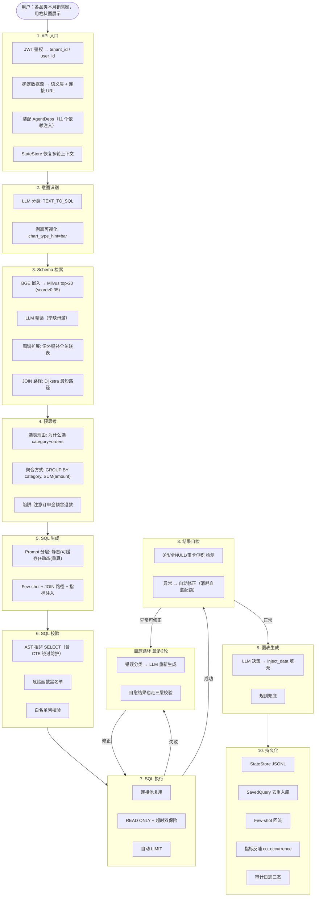

#### 动手练习

1. 不查文档，完整描述一次问答的 10 个步骤
2. 说出每个步骤的输入和输出
3. 说出每个步骤的失败处理策略
4. 画出自愈循环的流程图
5. 设置断点在 `run_agent()` 的 `intent` 阶段，跟踪一次完整的 TEXT_TO_SQL 问答

#### BI 领域补充知识

在深入代码之前，先了解几个 BI 领域的关键概念，这对理解系统的设计决策至关重要：

**Fan Trap（扇形陷阱）**:
```
当从一个表出发 JOIN 到两个 "一对多" 表时，聚合结果会翻倍。
示例: 订单(1) → (N) 订单项, 订单(1) → (N) 付款记录
SELECT SUM(amount) 会重复计算订单金额
```
- 系统的应对: 语义层显式定义关系基数, LLM 生成 JOIN 时引用关系 ID

**Chasm Trap（裂谷陷阱）**:
```
当两个 "多对一" 关系从同一个表出发时，JOIN 后数据丢失。
示例: 订单项 → (N) 产品, 订单项 → (N) 供应商
```
- 系统的应对: 预计算的 JOIN 路径 (Dijkstra) 优先走确定性路径

**Schema Linking（Schema 关联）**:
- 行业数据表明 29%-49% 的 Text-to-SQL 错误来自 Schema Linking 失败
- 系统的语义层 + 两阶段检索 + 图谱扩展 三重机制解决此问题
- 详见 V1 规划文档 `doc/v1-archive/规划文档.md` 第 288-350 行

---

### 阶段五：深入模块（预计 10-20 天，熟悉为主）

> ⚠️ 本阶段按"熟悉为主，不求全部掌握"的原则设计。建议先看第 5.1 节 Agent 执行引擎（核心中的核心），
> 再按 5.3 → 5.2 → 5.4 → 5.5 的顺序深入。每节推荐阅读本文档「附录：代码引用索引」对应章节快速定位代码。

#### 学习目标
逐模块深入理解实现细节，能够独立修改和扩展。

#### 5.1 Agent 执行引擎 (ai/)

> **深入阅读**：本文档「第十三章 关键实现深度解析」13.1-13.4 节

| 模块 | 文件 | 核心内容 | 学习重点 |
|------|------|---------|---------|
| 状态机编排 | `agent.py` | `AgentStage` 枚举, `AgentState` 状态（含中间产物/计数器/降级标记）, `run_agent()` 主循环 | while(true) 循环实现, 自愈回路, 配额共享 |
| 意图识别 | `intent.py` | 5 意图分类, Pydantic 强约束, confidence<0.6 降级, 可视化措辞剥离 | 如何用 LLM 做分类 + 降级策略 |
| 预思考 | `thinking.py` | LLM 分析选表理由/聚合方式/陷阱 | 思考结果如何注入 SQL 生成 |
| SQL 生成 | `sql_agent.py` | Prompt 分层（静态可缓存+动态重算）, Few-shot 注入, 白名单列取整个语义层 | 提示工程架构 |
| 自愈 | `sql_healer.py` | 错误码提取, 分类纠正, 熔断器三态, 不传原始 DB 错误 | 错误恢复模式 + 安全 |
| 图表生成 | `chart_agent.py` | LLM 只决策不填数据, JSON 自愈, 规则推断兜底 | 多策略图表生成 |
| 结果自检 | `result_checker.py` | 纯规则检查: 0行/全NULL/笛卡尔积，不调 LLM | 规则引擎模式 |
| 状态管理 | `state_store.py` | JSONL 持久化, 追问恢复, 维度继承, 压缩+状态补偿 | 多轮对话状态恢复 |
| 上下文压缩 | `compressor.py` | token>70% 触发, LLM 摘要, 状态补偿, 熔断器 | 压缩+补偿模式 |
| 记忆召回 | `recall.py` | 关键词相关召回, 指标反哺, 链路记忆 | 不调 LLM 的召回策略 |
| 自然语言回复 | `replier.py` | GENERAL/EXPLANATION 意图回复, 兜底文案 | 降级策略 |
| 用户澄清 | `ask_user.py` | Schema 不确定/结果不明确时暂停 | 人机交互决策点 |
| Schema 工具 | `schema_utils.py` | 白名单列提取, 关系扩展, JOIN 路径 Dijkstra | 图谱驱动的 Schema 构建 |

#### 5.2 业务服务层 (services/)

> **深入阅读**：本文档「第十三章」13.5-13.10 节

| 模块 | 文件 | 核心内容 | 学习重点 |
|------|------|---------|---------|
| 向量嵌入 | `embedder.py` | 本地 BGE, 惰性加载, LRU 缓存(2048), Protocol 抽象 | 抽象接口设计 |
| 两阶段检索 | `retriever.py` | 向量召回(top-20, score≥0.35) + LLM 精筛（宁缺毋滥） | 检索准确率优化 |
| 向量存储 | `vector_store.py` / `milvus_vector_store.py` | 抽象 Protocol, Milvus/Mock 实现 | 接口抽象 + 多实现 |
| SQL 执行 | `sql_executor.py` | 连接池复用, 超时双保险, 自动 LIMIT(AST判断), READ ONLY | 安全执行策略 |
| 数据源连接池 | `datasource_engine.py` | 动态连接池, Fernet 解密, 懒加载, evict_stale 防泄漏 | 动态资源管理 |
| 图谱服务 | `graph_service.py` | NetworkX 图, Dijkstra(weight=1-confidence), 社区发现, 中心度 | 图算法应用 |
| 语义扫描 | `semantic_scanner.py` | SQLAlchemy Inspector → 语义层 JSON, LLM 中文推断 | 元数据自动提取 |
| 图谱推断 | `knowledge_graph.py` | name_pattern(0.6) + LLM(0.7) 推断, 置信度更新 | 知识图谱演化 |
| 索引构建 | `indexer.py` | 语义层→向量(中文重复2遍), upsert 语义 | 索引生命周期 |
| Few-shot | `fewshot.py` | 相似 SQL 检索(top-3, score≥0.5), 回流机制 | 示例学习策略 |
| 元数据刷新 | `metadata_refresher.py` | 自动检测 schema 变更, 增量合并 | 后台运维 |
| 语义层差异 | `semantic_diff.py` | 表级 + 列级 diff, 纯函数 | 版本管理 |
| Skills 加载 | `skills_loader.py` | SKILL.md 解析, 热更新, 多租户隔离 | 插件式设计 |

#### 5.3 基础设施层 (core/)

> **深入阅读**：本文档「第十三章」13.11 节

| 模块 | 文件 | 核心内容 | 学习重点 |
|------|------|---------|---------|
| 配置管理 | `config.py` | Pydantic Settings, 环境变量, 数值范围校验, CHANGE_ME 拒绝 | 配置集中化模式 |
| 认证鉴权 | `auth.py` / `security.py` | JWT 四字段, RBAC 三角色, contextvars 多租户, 审计三层降级 | 安全体系 |
| LLM 客户端 | `llm_client.py` | AsyncOpenAI 封装, 429指数退避, connect/read 超时分离 | 可靠 LLM 调用 |
| SQL 校验 | `sql_validator.py` | 三层校验: AST(含CTE) + 危险函数 + 白名单列 | 安全防御 |
| 启动探测 | `startup_probe.py` | 必需服务 fail-fast, 可选服务降级 | 启动可靠性 |
| 定时调度 | `scheduler.py` | 健康检查(5min), 元数据刷新(6h), Redis健康(1min) | 后台任务管理 |
| Token 追踪 | `token_tracker.py` | contextvar 请求级, per-node 分段 | 可观测性 |
| Prompt 缓存 | `prompt_cache.py` | 静态段 MD5+TTL, BOUNDARY 分隔 | 性能优化 |
| 文件记忆 | `agent_memory.py` | .md 文件 + YAML frontmatter | 文件持久化 |
| Unicode 清洗 | `text_sanitize.py` | NFKC + 零宽/方向/私用区字符移除 | 安全清洗 |

#### 5.4 前端模块 (frontend/)

| 页面 | 文件 | 核心内容 | 学习重点 |
|------|------|---------|---------|
| 对话问答 | `ChatView.vue` | fetch+ReadableStream SSE, 管线可视化, ECharts, 斜杠命令 | 流式 UI 模式 |
| 数据源管理 | `DataSourceView.vue` | CRUD, 扫描进度轮询, 健康检查 | 状态管理 + 轮询 |
| 语义层编辑 | `SemanticView.vue` | 表/列/关系/指标编辑, 版本管理, 图谱可视化 | 复杂表格编辑 |
| 看板管理 | `DashboardView.vue` | GridStack 拖拽, 实时查询, 图表渲染 | 拖拽布局 |
| 登录注册 | `LoginView.vue` | 登录/注册/开发模式, JWT 存储 | 认证流程 |
| 历史记录 | `HistoryView.vue` | 审计日志, 慢查询, 对话历史 | 数据展示 |
| 系统监控 | `ObservabilityView.vue` | 健康状态, Prompt 追踪, 数据源指标 | 可观测性 |
| 记忆管理 | `MemoryView.vue` | 记忆 CRUD, 整理, 图谱同步冲突 | 文件管理 |
| 业务规则 | `SkillsView.vue` | Skills CRUD, 预览, 热更新 | 插件式管理 |
| API 客户端 | `client.ts` | Axios + JWT 拦截器 + 单例 Promise 自动刷新 | HTTP 拦截器模式 |
| 图谱组件 | `SchemaGraph.vue` | G6 v5 动态 import, 节点/边操作, 连线创建关系 | 图可视化集成 |

#### 5.5 数据模型 (db/)

> **完整 ER 图**：本文档「第五章 数据库模型关系」

| 表 | 模型 | 用途 | 核心字段 |
|----|------|------|---------|
| tenants | Tenant | 多租户 | id, name, is_active |
| users | User | 认证 | email, hashed_password, role (admin/user/read_only) |
| data_sources | DataSource | 业务库连接 | db_type, encrypted_password, scan_status |
| semantic_models | SemanticModel | 版本化语义层 | content (JSON), version, is_current |
| conversations | Conversation | 对话历史 | title, state_json, is_archived |
| saved_queries | SavedQuery | 成功的 SQL 查询 | question, sql_text, chart_config |
| audit_logs | AuditLog | 审计追踪 | resource_type, action, status (s/f/d), is_slow |
| dashboards | Dashboard | 看板容器 | name |
| dashboard_widgets | DashboardWidget | 图表组件 | question, query_sql, chart_type, position |

#### 验证方法

对每个模块，尝试回答：
1. 这个模块解决什么问题？
2. 输入是什么？输出是什么？
3. 失败时怎么处理？
4. 有哪些设计决策值得学习？

---

### 阶段六：安全与运维（预计 1-2 天）

#### 学习目标
理解系统的安全体系、多租户隔离、审计日志和运维策略。

#### 必读文档

| 文档 | 路径 | 内容 |
|------|------|------|
| **安全架构** | 本文档「第九章 安全架构」 | 六层安全防御 Mermaid 图 |
| **安全框架 Spec** | `doc/chatbi-v2/specs/security-framework/spec.md` | 安全设计 |
| **操作手册** | `doc/操作手册.md` | 部署、配置、故障排查 |

#### 安全层次

> **完整图**：本文档「第九章 安全架构」

| 层次 | 措施 | 代码位置 |
|------|------|---------|
| 启动安全 | CHANGE_ME 占位符检测, 必需服务探测 | `core/config.py`, `core/startup_probe.py` |
| 传输安全 | CORS(拒绝wildcard+credentials), JWT, 限流 | `main.py`, `core/auth.py`, `core/rate_limit.py` |
| 认证授权 | JWT 四字段, RBAC 三角色, contextvars 多租户 | `core/auth.py`, `db/models.py` |
| SQL 执行安全 | 三层校验+CTE防护, READ ONLY, 超时双保险, LIMIT | `core/sql_validator.py`, `services/sql_executor.py` |
| 数据安全 | Fernet 加密, Unicode 清洗, 审计三层降级, CSV 注入防护 | `core/security.py`, `core/text_sanitize.py` |
| Prompt 安全 | 宁缺毋滥, 自愈后校验, 不传原始DB错误, 白名单列 | `ai/retriever.py`, `ai/agent.py`, `ai/sql_healer.py` |

#### 多租户实现

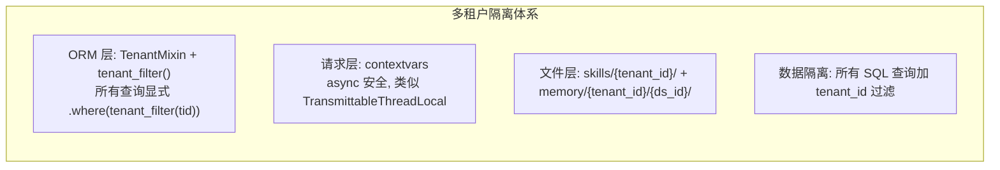

#### 验证方法

1. 说出 6 层安全防御的每一层
2. 解释多租户隔离的实现方式
3. 说出审计日志的三种状态和三层降级策略
4. 解释启动时发现 CHANGE_ME 占位符会怎样

---

### 阶段七：演进与扩展（预计 1 天）

#### 学习目标
理解系统的未来方向、待扩展的能力和如何参与开发。

#### 必读文档

| 文档 | 路径 | 内容 |
|------|------|------|
| **演进路线图** | `doc/chatbi-v2/EVOLUTION-ROADMAP.md` | 未来 13 个方向 |
| **ROADMAP** | `.planning/ROADMAP.md` | 当前阶段规划 |
| **STATE** | `.planning/STATE.md` | 当前状态和遗留债 |
| **任务清单** | `openspec/changes/chatbi-v2/tasks.md` | 任务详情 |

#### 未来方向（按优先级）

| 方向 | 状态 | 描述 | 难度 |
|------|------|------|------|
| 查询反哺知识图谱 | ✅ 已完成 | 链路经验沉淀 + 图谱反哺 | 中 |
| 复合指标 | ❌ 未开始 | 指标可引用子指标 | 中 |
| 对话内多轮精准追问 | ❌ 未开始 | 上下文感知的追问 | 中 |
| 检索质量提升 | ❌ 未开始 | 多路召回 + 重排序 | 中 |
| 看板快照模式 | ❌ 未开始 | 定时刷新 + 推送 | 低 |
| 数据源方言扩展 | ❌ 未开始 | Oracle, ClickHouse | 高 |
| 多模态输出 | ❌ 待研究 | 时序预测, 异常检测 | 高 |
| 缓存预热 | ❌ 未开始 | 常用查询预缓存 | 低 |
| 前端性能优化 | ❌ 未开始 | 虚拟列表, 懒加载 | 低 |
| 系统监控增强 | ❌ 未开始 | 指标看板, 告警 | 低 |
| 多表 JOIN 精度 | ❌ 待研究 | 5+ 表复杂 JOIN | 高 |
| 前端用户体验 | ❌ 未开始 | 拖拽引用, Markdown | 低 |
| 降低 LLM 调用频次 | ❌ 待研究 | 缓存, 预计算 | 高 |

#### 开发工作流

```
/ai:spec  →  /ai:plan  →  /ai:do  →  /ai:check
 需求定义     规划        执行       全面审查

命令定义在 .claude/commands/ai/
规格产出在 openspec/changes/chatbi-v2/ (OpenSpec 方法论)
执行计划在 .planning/phases/chatbi-v2/ (GSD 结构)
```

---

### 附录 A：常用命令

```bash
# 跑测试
uv run pytest backend/tests/ -q

# 启动后端
./start-backend.sh

# 启动前端
cd frontend && npx vite --host 0.0.0.0 --port 5173

# 查看任务进度
openspec list

# 查看当前状态
cat .planning/STATE.md

# 查看任务清单
cat openspec/changes/chatbi-v2/tasks.md
```

### 附录 B：参考文档索引

| 文档 | 路径 | 优先级 | 关键内容 |
|------|------|--------|---------|
| 项目状态 | `.planning/STATE.md` | P0 | 当前状态、已完成、遗留债、下一步 |
| 架构与学习指南 | 本文档 | P0 | 完整架构 + 学习路线图 + 代码索引 |
| 简历与面试准备 | `doc/简历技术点与面试准备.md` | P0 | 简历亮点 + 面试题 + 回答巧思 |
| Agent 执行引擎 Spec | `doc/chatbi-v2/specs/agent-execution-engine/spec.md` | P1 | 详细 Agent 设计 |
| 语义层 Spec | `doc/chatbi-v2/specs/semantic-layer/spec.md` | P1 | 语义层设计 |
| RAG 检索 Spec | `doc/chatbi-v2/specs/rag-retrieval/spec.md` | P1 | 两阶段检索 |
| 安全框架 Spec | `doc/chatbi-v2/specs/security-framework/spec.md` | P1 | 安全设计 |
| Claude Code 源码解读 | `doc/Claude-Code-源码深度解读.md` | P1 | 设计法则来源 |
| 海泰 ChatBI 分析 | `doc/海泰ChatBI完整代码分析.md` | P1 | BI 领域打法 |
| 经验教训 | `doc/经验教训.md` | P1 | v1 48 条坑 |

### 附录 C：学习路径时间表

| 阶段 | 内容 | 预估时间 | 产出 |
|------|------|---------|------|
| 一 | 项目背景与产品定位 | 1-2 天 | 产品理解 |
| 二 | 技术栈基础 | 7-14 天 | 技术能力（按需学习） |
| 三 | 系统架构 | 1-2 天 | 架构理解 |
| 四 | 核心数据流 | 1-2 天 | 流程理解 |
| 五 | 深入模块 | 10-20 天 | 模块理解（熟悉为主） |
| 六 | 安全与运维 | 1-2 天 | 安全理解 |
| 七 | 演进与扩展 | 1 天 | 方向理解 |
| **总计** | | **22-43 天** | **全栈掌握（熟悉为主）** |

### 附录 D：速查表——项目中的经典设计模式

| 模式 | 位置 | 说明 |
|------|------|------|
| **单例 + 惰性加载** | 所有 `get_*()` 函数 | 构造不加载, 首次使用时才初始化 |
| **Protocol 抽象** | `Embedder`, `VectorStore` | 接口定义, 可切换实现 |
| **依赖注入** | `AgentDeps` dataclass | 测试可 mock, 生产接真实服务 |
| **状态机** | `AgentStage` + `run_agent()` | 严格前向, 上游失败直接 final |
| **熔断器** | `SelfHealCircuitBreaker`, `CompressionCircuitBreaker` | 三态, 连续失败后停止 |
| **Fail-Closed** | 所有安全相关 | 出问题拒绝而非放行 |
| **宁缺毋滥** | 检索/匹配/识别 | 失败返回空, 禁止 fallback |
| **while(true) 循环** | SQL 生成→执行→自愈→再执行 | 不是一次调用, 是循环 |
| **压缩+补偿** | 压缩后补回语义层 + SQL + 筛选 | 状态补偿防止信息丢失 |
| **分层缓存** | Prompt 中可缓存/不可缓存分离 | 语义层/Skills 可缓存 |
| **错误双分类** | `error_is_internal` | 内部异常不泄露, 业务错误可下发 |
| **配额共享** | SQL 自愈 + 结果自检共享配额 | 避免无限循环 |
## 附录：代码引用索引

# ChatBI v2 代码引用索引

> 完整代码索引，覆盖 backend/app/ + frontend/src/ 全部关键定义。
> 格式：`file:line` — 定义名: 描述

---

## backend/app/ai/ — Agent 执行引擎（14 个文件）

### `ai/agent.py` — 状态机编排
| 行号 | 定义 | 描述 |
|------|------|------|
| 31 | `AgentStage` | 状态机阶段枚举 (INTENT/SCHEMA_SEARCH/GENERATE_SQL/EXECUTE_SQL/SELF_CHECK/VISUALIZE/FINAL) |
| 43 | `AgentState` | Agent 执行状态 dataclass（含所有中间产物、计数器、降级标记） |
| 103 | `AgentDeps` | Agent 依赖注入 dataclass（各节点服务，测试可 mock） |
| 123 | `run_agent()` | **主循环**：状态机编排，对标 Claude Code while(true) |

### `ai/intent.py` — 意图识别
| 行号 | 定义 | 描述 |
|------|------|------|
| 34 | `CONFIDENCE_DEGRADE_THRESHOLD` | 置信度降级阈值 (0.6) |
| 36 | `MAX_RETRIES` | 重试最大次数 (2) |
| 39 | `IntentOutput` | 意图识别输出 Pydantic 模型 |
| 69 | `strip_visualization()` | 剥离可视化措辞 ("用柱状图展示" → "柱状图" hint) |
| 97 | `_INTENT_PROMPT` | LLM 意图分类 prompt |
| 123 | `classify_intent()` | **意图分类**：5 意图 + Pydantic 强约束 + 降级 |
| 211 | `safe_normalized_question()` | 安全提取 normalized_question |

### `ai/thinking.py` — 预思考
| 行号 | 定义 | 描述 |
|------|------|------|
| 29 | `ThinkingResult` | 预思考结果 dataclass |
| 39 | `format_thinking_hint()` | 格式化预思考为 SQL 生成提示 |
| 59 | `_THINKING_PROMPT` | LLM 预思考 prompt |
| 78 | `think()` | **预思考**：选表理由 + 聚合方式 + 陷阱警告 |

### `ai/sql_agent.py` — SQL 生成
| 行号 | 定义 | 描述 |
|------|------|------|
| 29 | `GenerateResult` | SQL 生成结果 dataclass |
| 46 | `_SYSTEM_PROMPT` | SQL 生成系统 prompt（分层设计） |
| 59 | `_build_allowed_columns_section()` | 构建白名单列约束段 |
| 65 | `_build_datatype_constraint_section()` | 构建数据类型约束段 |
| 76 | `_build_dynamic_context()` | 构建动态上下文（few-shot/记忆/Skills） |
| 101 | `_extract_sql()` | 从 LLM 响应提取 SQL |
| 113 | `generate_sql()` | **SQL 生成**：含 Prompt 分层 + Few-shot 注入 |

### `ai/sql_healer.py` — SQL 自愈
| 行号 | 定义 | 描述 |
|------|------|------|
| 34 | `_ERROR_CODE_MAP` | 错误码前缀 → 分类映射 |
| 47 | `ErrorCategory` | 错误分类枚举 |
| 63 | `extract_error_code()` | 提取错误码 |
| 80 | `SelfHealCircuitBreaker` | 自愈熔断器 |
| 135 | `get_circuit_breaker()` | 熔断器单例 |
| 152 | `HealResult` | 自愈结果 dataclass |
| 162 | `_SECURITY_RULES` | 安全规则（自愈 prompt 保留） |
| 171 | `_CATEGORY_HINTS` | 按错误分类的纠正 hint |
| 180 | `heal_sql()` | **SQL 自愈**：错误分类 → 纠正 prompt → 重新生成 |

### `ai/chart_agent.py` — 图表生成
| 行号 | 定义 | 描述 |
|------|------|------|
| 30 | `ChartResult` | 图表生成结果 dataclass |
| 41 | `heal_json()` | JSON 自愈（统计括号差异 → 补全） |
| 106 | `_TIME_KEYWORDS` | 时间相关列关键词冻结集 |
| 115 | `_PIE_MAX_SLICES` | 饼图最大切片数 (10) |
| 117 | `_NUMERIC_COL_THRESHOLD` | 数值列检测阈值 (0.8) |
| 119 | `_DATAZOOM_THRESHOLD` | 数据缩放阈值 (20) |
| 139 | `analyze_data_shape()` | 分析数据形状 |
| 266 | `_build_kpi_option()` | 构建 KPI 指标卡 ECharts option |
| 302 | `infer_chart_by_rule()` | **规则推断**图表类型（LLM 降级兜底） |
| 415 | `_CHART_PROMPT` | LLM 图表选择 prompt |
| 467 | `inject_data()` | 注入数据到 ECharts option |
| 584 | `generate_chart()` | **图表生成**：LLM → JSON 自愈 → 规则兜底 |

### `ai/result_checker.py` — 结果自检
| 行号 | 定义 | 描述 |
|------|------|------|
| 26 | `ResultIssue` | 结果问题枚举 |
| 35 | `CheckResult` | 自检结果 dataclass |
| 47 | `_count_all_null_columns()` | 检查全 NULL 列 |
| 65 | `_is_count_zero()` | 检查 COUNT=0 |
| 76 | `check_result()` | **结果自检**：纯规则（零行/全NULL/笛卡尔积） |

### `ai/replier.py` — 自然语言回复
| 行号 | 定义 | 描述 |
|------|------|------|
| 24 | `_FALLBACK_REPLY` | 兜底回复文案 |
| 26 | `_REPLY_PROMPT` | LLM 回复生成 prompt |
| 41 | `generate_reply()` | **回复生成**：GENERAL/EXPLANATION 意图 |

### `ai/ask_user.py` — 用户澄清
| 行号 | 定义 | 描述 |
|------|------|------|
| 25 | `AskUserReason` | 澄清原因枚举 |
| 39 | `should_ask_for_schema()` | Schema 不确定 → ask_user |
| 71 | `should_ask_for_result()` | 结果不明确 → ask_user |

### `ai/recall.py` — 记忆召回
| 行号 | 定义 | 描述 |
|------|------|------|
| 27 | `recall_memories()` | **记忆召回**：关键词相关（不调 LLM） |
| 148 | `format_memories_for_prompt()` | 格式化记忆为 Prompt 文本 |
| 174 | `extract_memory_from_turn()` | 从对话轮提取记忆 |
| 294 | `consolidate_memories()` | 记忆整理/聚合 |
| 438 | `save_query_memory()` | 保存查询记忆 |
| 508 | `_extract_join_pairs()` | 提取 JOIN 对 |
| 523 | `_extract_join_on_conditions()` | 提取 ON 条件 |
| 583 | `_build_linkage_content()` | 构建链路记忆内容 |
| 683 | `persist_linkage_memory()` | **持久化链路记忆** |
| 859 | `persist_metric_feedback()` | **持久化指标反馈** |

### `ai/compressor.py` — 上下文压缩
| 行号 | 定义 | 描述 |
|------|------|------|
| 25 | `estimate_tokens()` | Token 估算 |
| 71 | `should_compress()` | 是否触发压缩（阈值 70%） |
| 93 | `CompactResult` | 压缩结果 dataclass |
| 111 | `_COMPACT_PROMPT` | 压缩 prompt |
| 119 | `compact_history()` | **上下文压缩**：LLM 摘要 + 状态补偿 |
| 190 | `CompressionCircuitBreaker` | 压缩熔断器 |
| 230 | `get_compression_circuit_breaker()` | 熔断器单例 |

### `ai/state_store.py` — 对话状态管理
| 行号 | 定义 | 描述 |
|------|------|------|
| 26 | `DecisionPoint` | 关键决策点 dataclass |
| 48 | `ConversationState` | 对话状态 dataclass（结构化状态） |
| 156 | `StateStore` | **状态存储**：JSONL 持久化 save/load |
| 248 | `_turns_to_messages()` | 轮次 → 消息列表转换 |
| 273 | `_format_state_compensation()` | 状态补偿格式化 |
| 294 | `format_history_text()` | **历史文本格式化**：含压缩 + 状态补偿 |
| 371 | `_messages_to_text()` | 消息列表 → 纯文本 |

### `ai/schema_utils.py` — Schema 工具
| 行号 | 定义 | 描述 |
|------|------|------|
| 32 | `extract_allowed_columns()` | 提取白名单列（语义层 = 安全边界） |
| 61 | `get_schema_graph()` | 构建 SchemaGraph（NetworkX） |
| 83 | `expand_with_relationships()` | **图谱扩展**：沿关系图补全关联表 |
| 150 | `_expand_with_bfs()` | BFS 扩展实现 |
| 201 | `build_schema_context()` | 构建 Schema 上下文文本 |
| 258 | `build_metrics_hint()` | 构建业务指标提示段 |
| 298 | `build_join_path_section()` | **JOIN 路径预计算**：Dijkstra 最短路径 |

### `ai/chat_utils.py` — 共享工具
| 行号 | 定义 | 描述 |
|------|------|------|
| 17 | `normalize_value()` | 值归一化 |
| 42 | `serialize_thinking()` | 预思考序列化 |
| 61 | `build_schema_context_fallback()` | 无语义层时的兜底 Schema 构建 |
| 73 | `_extract_model_name()` | 提取模型名 |
| 80 | `inherit_prev_tables()` | **追问表继承**：检索结果 ∪ 上轮表 |

### `ai/question_generator.py` — 示例问题生成
| 行号 | 定义 | 描述 |
|------|------|------|
| 24 | `_QUESTION_PROMPT` | LLM 示例问题生成 prompt |
| 42 | `generate_sample_questions()` | 生成示例问题 |
| 81 | `_build_schema_summary()` | Schema 摘要 |
| 107 | `_parse_questions()` | 解析 LLM 输出 |
| 120 | `_fallback_questions()` | 规则兜底生成（LLM 失败时） |

---

## backend/app/services/ — 业务服务层（16 个文件）

### `services/embedder.py` — 向量嵌入
| 行号 | 定义 | 描述 |
|------|------|------|
| 40 | `Embedder` | 嵌入器抽象 Protocol |
| 62 | `LocalEmbedder` | **本地 BGE 实现**：惰性加载 + LRU 缓存 |
| 158 | `get_embedder()` | 单例工厂 |
| 183 | `reset_embedder()` | 重置单例（测试用） |
| 189 | `embed_texts()` | 便捷嵌入函数 |

### `services/retriever.py` — 两阶段检索
| 行号 | 定义 | 描述 |
|------|------|------|
| 31 | `RetrievalResult` | 检索结果 dataclass |
| 39 | `retrieve()` | **两阶段检索**：向量召回 → LLM 精筛 |
| 92 | `_candidates_to_models()` | 候选 → 模型 dict 转换 |
| 106 | `_llm_refine()` | **LLM 精筛**：宁缺毋滥 |

### `services/vector_store.py` — 向量存储抽象
| 行号 | 定义 | 描述 |
|------|------|------|
| 30 | `VectorRecord` | 向量记录 dataclass |
| 43 | `SearchResult` | 搜索结果 dataclass |
| 52 | `VectorStore` | 向量存储抽象 Protocol |
| 99 | `_cosine_similarity()` | 余弦相似度计算 |
| 109 | `_matches_filter()` | 标量过滤匹配 |
| 114 | `MockVectorStore` | **Mock 实现**：纯内存，开发/测试用 |
| 185 | `get_vector_store()` | 工厂：Milvus/Mock 切换 |
| 283 | `reset_vector_store()` | 重置单例（测试用） |

### `services/milvus_vector_store.py` — Milvus 实现
| 行号 | 定义 | 描述 |
|------|------|------|
| 34 | `_build_filter_expr()` | 构建 Milvus filter 表达式 |
| 60 | `_build_id_filter()` | 构建 ID filter |
| 66 | `MilvusVectorStore` | **Milvus 实现**：HNSW 索引 + IP 度量 |

### `services/sql_executor.py` — SQL 执行
| 行号 | 定义 | 描述 |
|------|------|------|
| 29 | `ExecuteResult` | 执行结果 dataclass |
| 47 | `_inject_limit()` | **自动 LIMIT**：无 LIMIT 的 SELECT 自动加 |
| 71 | `_execute_sync()` | 同步执行（to_thread 内跑） |
| 130 | `execute_sql()` | **SQL 执行**：连接池复用 + 超时双保险 + READ ONLY |

### `services/datasource_engine.py` — 数据源连接池
| 行号 | 定义 | 描述 |
|------|------|------|
| 30 | `build_engine_url()` | 构建 SQLAlchemy engine URL |
| 54 | `datasource_to_url()` | DataSource → URL（含 Fernet 解密） |
| 73 | `DataSourceEnginePool` | **动态连接池**：懒加载 + 引用计数 |
| 227 | `get_engine_pool()` | 单例工厂 |

### `services/datasource_health.py` — 数据源健康检查
| 行号 | 定义 | 描述 |
|------|------|------|
| 43 | `_PING_TIMEOUT` | Ping 超时 (5s) |
| 47 | `PingResult` | Ping 结果 dataclass |
| 59 | `_ping_sync()` | 同步 ping |
| 96 | `ping_datasource()` | 异步 ping 单个数据源 |
| 121 | `check_all_datasources_health()` | 批量健康检查（并发） |
| 222 | `_audit_health()` | 健康检查审计日志 |

### `services/graph_service.py` — 知识图谱服务
| 行号 | 定义 | 描述 |
|------|------|------|
| 34 | `JoinPath` | JOIN 路径 dataclass |
| 45 | `_EDGE_ON` / `_EDGE_*` | 边属性键常量 |
| 54 | `_NODE_*` | 节点属性键常量 |
| 60 | `SchemaGraph` | **图谱服务**：NetworkX 构建 + Dijkstra + 社区发现 + 中心度分析 |

### `services/semantic_scanner.py` — 数据源扫描
| 行号 | 定义 | 描述 |
|------|------|------|
| 30 | `InspectorLike` | DB Inspector 抽象 Protocol |
| 41 | `_column_comment()` | 提取列注释 |
| 58 | `_infer_cardinality()` | 推断关系基数 |
| 64 | `scan_data_source()` | **扫描数据源** → SemanticModelContent |
| 93 | `_scan_table()` | 扫描单表 |
| 163 | `_infer_semantic_type()` | 推断语义类型 (measure/dimension) |
| 180 | `_scan_relationships()` | 扫描外键关系 |
| 209 | `_AMOUNT_KEYWORDS` / `_COUNT_KEYWORDS` | 金额/计数关键词 |
| 218 | `_type_matches()` | 类型匹配检查 |
| 245 | `_infer_simple_metrics()` | 规则推断简单指标 |
| 352 | `enrich_metrics()` | LLM 丰富指标描述 |
| 611 | `_make_semaphore()` | 并发控制信号量 |

### `services/knowledge_graph.py` — 图谱推断与演化
| 行号 | 定义 | 描述 |
|------|------|------|
| 38 | `NAME_PATTERN_CONFIDENCE` | name_pattern 推断置信度 (0.6) |
| 39 | `AI_INFERRED_CONFIDENCE` | LLM 推断置信度 (0.7) |
| 44 | `_ON_BLOCKED_CHARS` | ON 条件字符黑名单 |
| 47 | `_ON_WORD_RE` | ON 条件关键词黑名单 |
| 50 | `FREQUENT_JOIN_THRESHOLD` | 频繁 JOIN 阈值 (3) |
| 51 | `FREQUENT_JOIN_BOOST` | 频繁 JOIN 置信度增量 (0.1) |
| 54 | `CORRECTION_PENALTY` | 纠正惩罚 (-0.15) |
| 55 | `PRAISE_BOOST` | 点赞增量 (+0.05) |
| 56 | `MIN_CONFIDENCE` / `MAX_CONFIDENCE` | 置信度范围 [0.1, 0.95] |
| 62 | `_strip_table_prefix()` | 去除 Schema 前缀 |
| 70 | `_infer_relationships_by_name()` | 按名称模式推断关系 |
| 129 | `_infer_relationships_batch_by_llm()` | LLM 批量推断关系 |
| 245 | `infer_knowledge_graph()` | **知识图谱推断**：name_pattern + LLM |
| 316 | `mine_implicit_relationships()` | 挖掘隐式关系 |
| 374 | `apply_feedback_signals()` | 应用反馈信号调整 confidence |
| 426 | `VersionConflictError` | 版本冲突异常 |
| 442 | `linkage_memories_to_cooccurrence()` | 链路记忆 → 共现计数 |
| 468 | `_compute_confidence_updates()` | 置信度更新计算 |
| 511 | `_discover_new_pairs()` | 发现新表对 |
| 549 | `apply_confidence_updates()` | **应用置信度更新** |
| 721 | `sync_linkage_to_graph()` | **同步链路记忆到图谱** |

### `services/fewshot.py` — Few-shot 检索
| 行号 | 定义 | 描述 |
|------|------|------|
| 26 | `FEWSHOT_SCORE_THRESHOLD` | 相似度阈值 (0.5) |
| 30 | `FewShotExample` | Few-shot 示例 dataclass |
| 37 | `find_fewshot_examples()` | **检索相似 SQL 示例** |
| 98 | `format_fewshot_prompt()` | 格式化 few-shot 提示 |
| 112 | `index_fewshot_example()` | **索引新示例**（回流） |

### `services/skills_loader.py` — Skills 加载器
| 行号 | 定义 | 描述 |
|------|------|------|
| 33 | `Skill` | Skill 定义 dataclass |
| 84 | `SkillsLoader` | **Skills 加载器**：SKILL.md 解析 + 热更新 + 多租户 |
| 207 | `get_skills_loader()` | 单例工厂 |
| 217 | `reset_skills_loader()` | 重置单例（测试用） |

### `services/indexer.py` — 向量索引构建
| 行号 | 定义 | 描述 |
|------|------|------|
| 33 | `model_to_text()` | Model → 文本 |
| 72 | `metric_to_text()` | Metric → 文本 |
| 94 | `IndexResult` | 索引构建结果 dataclass |
| 100 | `build_index()` | **构建索引**：语义层 → 向量索引 |

### `services/indexer_update.py` — 索引增量更新
| 行号 | 定义 | 描述 |
|------|------|------|
| 34 | `RebuildResult` | 重建结果 dataclass |
| 41 | `rebuild_index()` | **重建索引**：delete + re-insert |

### `services/semantic_diff.py` — 语义层差异比较
| 行号 | 定义 | 描述 |
|------|------|------|
| 26 | `_COL_DIFF_ATTRS` | 列差异比较属性 |
| 30 | `diff_semantic_contents()` | 语义层内容 diff |
| 77 | `_diff_columns()` | 列级别 diff |
| 105 | `is_empty_diff()` | 空 diff 检查 |

### `services/metadata_refresher.py` — 元数据自动刷新
| 行号 | 定义 | 描述 |
|------|------|------|
| 41 | `detect_and_refresh_metadata()` | **检测并刷新元数据** |
| 93 | `_refresh_single_datasource()` | 刷新单个数据源 |
| 225 | `_merge_content()` | 新旧内容合并 |
| 296 | `_audit_refresh()` | 刷新审计日志 |

---

## backend/app/core/ — 基础设施层（18 个文件）

### `core/config.py` — 集中配置
| 行号 | 定义 | 描述 |
|------|------|------|
| 20 | `Settings` | **应用配置**：Pydantic BaseSettings，所有魔法数字集中管理 |
| 339 | `get_settings()` | 缓存单例 |
| 344 | `validate_settings_on_startup()` | 启动配置校验：CHANGE_ME 拒绝启动 |

### `core/auth.py` — 认证鉴权
| 行号 | 定义 | 描述 |
|------|------|------|
| 63 | `AuthUser` | 认证用户 Pydantic 模型 |
| 82 | `get_current_user()` | **JWT 鉴权依赖**：提取当前用户 |
| 174 | `require_role()` | **RBAC 依赖工厂**：admin/user/read_only |
| 215 | `GLOBAL_TABLES` | 全局表名集合（免租户过滤） |
| 231 | `set_current_tenant()` | 设置当前租户（contextvar） |
| 240 | `get_current_tenant()` | 获取当前租户 |
| 258 | `write_audit_log()` | **审计日志写入**：success/fail/denied 三态 |

### `core/security.py` — 密码与加密
| 行号 | 定义 | 描述 |
|------|------|------|
| 20 | `hash_password()` | bcrypt 密码哈希 |
| 34 | `verify_password()` | 密码验证 |
| 55 | `_get_fernet()` | Fernet 密码器单例 |
| 69 | `encrypt_password()` | 数据源密码加密 |
| 78 | `decrypt_password()` | 数据源密码解密 |
| 89 | `create_access_token()` | JWT Access Token 生成 |
| 105 | `create_refresh_token()` | JWT Refresh Token 生成 |
| 122 | `decode_token()` | JWT Token 解码 |

### `core/llm_client.py` — LLM 客户端
| 行号 | 定义 | 描述 |
|------|------|------|
| 37 | `get_llm_client()` | LLM 客户端单例 (AsyncOpenAI) |
| 59 | `get_embedding_client()` | Embedding 客户端单例 |
| 75 | `extract_content()` | 安全提取 LLM 响应内容 |
| 90 | `llm_chat()` | **LLM 调用**：重试/退避 + Token 追踪 + Prompt 捕获 |
| 200 | `reset_clients()` | 重置客户端（测试用） |
| 207 | `infer_column_chinese()` | LLM 推断列中文名 |

### `core/llm_json.py` — JSON 解析
| 行号 | 定义 | 描述 |
|------|------|------|
| 25 | `parse_json_response()` | **LLM JSON 解析**：Markdown 去除 + 括号匹配 + 容错 |

### `core/sql_validator.py` — SQL 三层校验
| 行号 | 定义 | 描述 |
|------|------|------|
| 31 | `_DANGEROUS_FUNCTIONS` | 危险函数黑名单 (LOAD_FILE/SLEEP/BENCHMARK 等) |
| 60 | `_collect_derivable_names()` | 收集 SQL 中可推导的表/列名 |
| 99 | `ValidationResult` | 校验结果 dataclass |
| 109 | `validate_sql()` | **三层校验**：Layer1 AST + Layer2 危险函数 + Layer3 白名单列 |

### `core/redis_client.py` — Redis 客户端
| 行号 | 定义 | 描述 |
|------|------|------|
| 36 | `get_redis()` | Redis 连接（降级模式） |
| 99 | `check_redis_health()` | 健康检查 |
| 130 | `_sanitize_url()` | URL 脱敏（日志安全） |
| 140 | `close_redis()` | 关闭连接 |

### `core/milvus_client.py` — Milvus 客户端
| 行号 | 定义 | 描述 |
|------|------|------|
| 34 | `get_milvus_client()` | Milvus 客户端单例 |
| 64 | `is_milvus_healthy()` | 健康检查 |
| 96 | `reset_milvus_client()` | 重置（测试用） |
| 115 | `close_milvus()` | 关闭连接 |

### `core/rate_limit.py` — 限流
| 行号 | 定义 | 描述 |
|------|------|------|
| 35 | `get_limiter()` | slowapi Limiter 单例 |

### `core/logging.py` — 日志
| 行号 | 定义 | 描述 |
|------|------|------|
| 29 | `setup_logging()` | 日志配置：控制台 + 每日轮转文件 |

### `core/checkpointer.py` — 检查点
| 行号 | 定义 | 描述 |
|------|------|------|
| 35 | `Checkpointer` | **JSONL 检查点**：追加写入 |
| 255 | `get_checkpointer()` | 单例工厂 |

### `core/startup_probe.py` — 启动探测
| 行号 | 定义 | 描述 |
|------|------|------|
| 41 | `ProbeResult` | 探测结果 dataclass |
| 52 | `_redact()` | URL 脱敏 |
| 66 | `probe_postgres()` | PostgreSQL 探测 |
| 88 | `probe_redis()` | Redis 探测 |
| 113 | `probe_milvus()` | Milvus 探测 |
| 141 | `_PROBES` | 探测函数映射 |
| 148 | `_probe()` | 单次探测 |
| 158 | `check_required_services()` | 必须服务探测（fail-fast） |
| 192 | `check_optional_services()` | 可选服务探测（降级） |
| 213 | `run_startup_probes()` | **运行全部启动探测** |

### `core/scheduler.py` — 定时任务
| 行号 | 定义 | 描述 |
|------|------|------|
| 33 | `get_scheduler()` | APScheduler 单例 |
| 42 | `start_scheduler()` | 启动调度器 |
| 81 | `_register_jobs()` | 注册所有定时任务 |
| 137 | `shutdown_scheduler()` | 关闭调度器 |
| 154 | `add_interval_job()` | 添加间隔任务 |
| 187 | `_run_datasource_health_check()` | 数据源健康检查定时任务 |
| 205 | `_run_metadata_refresh()` | 元数据刷新定时任务 |
| 223 | `_run_redis_health_check()` | Redis 健康检查定时任务 |

### `core/token_tracker.py` — Token 追踪
| 行号 | 定义 | 描述 |
|------|------|------|
| 24 | `NodeUsage` | 节点用量 dataclass |
| 49 | `TokenTracker` | **Token 追踪器**：contextvar 请求级 |
| 102 | `start_token_tracking()` | 开始追踪 |
| 107 | `stop_token_tracking()` | 停止追踪 |
| 116 | `track_usage()` | 记录节点用量 |
| 130 | `get_node_usage()` | 查询节点用量 |

### `core/prompt_capture.py` — Prompt 捕获
| 行号 | 定义 | 描述 |
|------|------|------|
| 27 | `PromptRecord` | Prompt 记录 dataclass |
| 48 | `PromptCapture` | **Prompt 捕获器**：contextvar 请求级 |
| 76 | `start_prompt_capture()` | 开始捕获 |
| 81 | `stop_prompt_capture()` | 停止捕获 |
| 90 | `record_prompt()` | 记录 Prompt |

### `core/prompt_cache.py` — Prompt 缓存
| 行号 | 定义 | 描述 |
|------|------|------|
| 20 | `PromptSection` | Prompt 段 dataclass |
| 51 | `PromptCache` | **TTL 缓存**：语义层/Skills 可缓存段 |
| 156 | `get_prompt_cache()` | 单例工厂 |

### `core/text_sanitize.py` — Unicode 清洗
| 行号 | 定义 | 描述 |
|------|------|------|
| 22 | `_ZERO_WIDTH` | 零宽字符正则 |
| 24 | `_DIRECTIONAL` | 方向字符正则 |
| 26 | `_PRIVATE_USE` | 私用区字符正则 |
| 28 | `_FORMAT_CONTROL` | 格式控制字符正则 |
| 31 | `sanitize_text()` | **Unicode 清洗**：NFKC 归一化 + 危险字符移除 |

### `core/agent_memory.py` — 文件记忆存储
| 行号 | 定义 | 描述 |
|------|------|------|
| 19 | `FIRST_SECTION_PATTERN` | Markdown 首段标题正则 |
| 24 | `AgentMemoryStore` | **文件记忆存储**：.md 文件 + YAML frontmatter |
| 496 | `get_agent_memory_store()` | 单例工厂 |

---

## backend/app/db/ — 数据持久化层（2 个文件）

### `db/models.py` — ORM 模型
| 行号 | 定义 | 描述 |
|------|------|------|
| 28 | `new_uuid()` | UUID 生成 |
| 32 | `utcnow()` | 当前 UTC 时间 |
| 43 | `TenantMixin` | **多租户 Mixin**：tenant_id + tenant_filter() |
| 56 | `Tenant` | 租户模型 |
| 72 | `User` | 用户模型（含 role: admin/user/read_only） |
| 99 | `DataSource` | 数据源模型（含 scan_status 状态机） |
| 135 | `SemanticModel` | 语义模型（版本化 JSON） |
| 158 | `Conversation` | 对话模型 |
| 179 | `SavedQuery` | 保存查询模型 |
| 208 | `Dashboard` | 看板模型 |
| 224 | `DashboardWidget` | 看板组件模型 |
| 259 | `AuditLog` | 审计日志模型（success/fail/denied） |

### `db/session.py` — 数据库会话
| 行号 | 定义 | 描述 |
|------|------|------|
| 26 | `Base` | SQLAlchemy DeclarativeBase |
| 44 | `_get_engine_kwargs()` | 引擎参数构建 |
| 71 | `get_engine()` | 异步引擎（懒加载） |
| 87 | `get_async_session_factory()` | 异步会话工厂 |
| 99 | `get_engine_sync()` | 同步引擎（迁移用） |
| 111 | `get_db()` | **FastAPI DB 依赖** |
| 122 | `auto_create_tables()` | **自动建表**：create_all + 增量补列 |
| 151 | `_ensure_enum_types()` | 确保枚举类型存在 |
| 172 | `_add_missing_columns()` | 增量补列 |
| 207 | `_add_missing_constraints()` | 增量补约束 |

---

## backend/app/schemas/ — Pydantic 模型（1 个文件）

### `schemas/semantic_layer.py` — 语义层 JSON Schema
| 行号 | 定义 | 描述 |
|------|------|------|
| 30 | `_Inferred` | 推断来源追踪基类 |
| 51 | `Column` | 列定义 |
| 66 | `Relationship` | 关系定义 |
| 84 | `_METRIC_DANGEROUS` | 指标危险 SQL 正则 |
| 88 | `_DDL_DML_KEYWORDS` | DDL/DML 关键词正则 |
| 95 | `Metric` | 指标定义（含复合指标展开） |
| 149 | `CalculatedField` | 计算字段定义 |
| 160 | `Model` | 表模型定义 |
| 173 | `SemanticModelContent` | 完整语义层模型 |

---

## backend/app/api/ — HTTP API 路由层（13 个文件）

### `api/__init__.py` — 路由聚合
| 行号 | 定义 | 描述 |
|------|------|------|
| 31 | `ping()` | 健康 ping |

### `api/auth.py` — 认证
| 行号 | 定义 | 描述 |
|------|------|------|
| 56 | `_validate_email()` | 邮箱格式校验 |
| 70 | `RegisterRequest` | 注册请求体 |
| 76 | `LoginRequest` | 登录请求体 |
| 81 | `RefreshRequest` | 刷新请求体 |
| 85 | `TokenResponse` | Token 响应体 |
| 97 | `register()` | **注册**：创建租户 + 用户 |
| 158 | `_check_login_lock()` | 登录锁定检查 |
| 181 | `_record_login_failure()` | 记录登录失败 |
| 192 | `_clear_login_lock()` | 清除登录锁定 |
| 199 | `login()` | **登录**：JWT 签发 |
| 281 | `refresh_token()` | **刷新 Token** |

### `api/chat.py` — 同步问答
| 行号 | 定义 | 描述 |
|------|------|------|
| 40 | `ChatRequest` | 问答请求体 |
| 47 | `AskUserPayload` | ask_user 响应体 |
| 54 | `TokenUsagePayload` | Token 用量响应体 |
| 63 | `ChatResponse` | 问答响应体 |
| 96 | `_persist_co_occurrence()` | 持久化共现计数 |
| 148 | `build_agent_deps()` | **装配 Agent 依赖** |
| 298 | `chat()` | **同步问答**端点 |

### `api/chat_stream.py` — 流式问答
| 行号 | 定义 | 描述 |
|------|------|------|
| 65 | `_sse()` | SSE 事件格式化 |
| 100 | `chat_stream()` | **流式问答**端点 (SSE) |
| 726 | `_persist_skeleton()` | 持久化对话骨架 |
| 760 | `_persist()` | 持久化完整轮次 |

### `api/data_sources.py` — 数据源管理
| 行号 | 定义 | 描述 |
|------|------|------|
| 91 | `create_data_source()` | 创建数据源 |
| 274 | `scan_data_source_endpoint()` | 触发扫描 |
| 315 | `_run_scan_background()` | 后台扫描任务 |
| 481 | `_update_scan()` / `_finish_scan()` / `_fail_scan()` | 扫描状态更新 |
| 516 | `_apply_inferred_relationships()` | 应用推断关系 |
| 538 | `_enrich_with_llm()` | LLM 丰富 |

### `api/semantic_models.py` — 语义层管理
| 行号 | 定义 | 描述 |
|------|------|------|
| 49 | `get_current_semantic_model()` | 获取当前语义层 |
| 77 | `list_versions()` | 版本列表 |
| 115 | `rollback_to_version()` | 版本回滚 |
| 241 | `patch_semantic_model()` | 语义层编辑 |
| 390 | `patch_metric()` | 指标编辑 |
| 572 | `diff_versions()` | 版本差异比较 |

### `api/dashboard.py` — 看板管理
| 行号 | 定义 | 描述 |
|------|------|------|
| 191 | `list_dashboards()` | 看板列表 |
| 217 | `create_dashboard()` | 创建看板 |
| 238 | `update_dashboard()` | 更新看板 |
| 265 | `delete_dashboard()` | 删除看板 |
| 295 | `get_dashboard()` | 看板详情 |
| 331 | `add_widget()` | 添加组件 |
| 434 | `delete_widget()` | 删除组件 |
| 458 | `update_widget_layout()` | 更新布局 |
| 500 | `refresh_widget()` | 刷新组件数据 |

### `api/graph.py` — 知识图谱 API
| 行号 | 定义 | 描述 |
|------|------|------|
| 97 | `get_full_graph()` | 全量图谱 |
| 108 | `get_subgraph()` | 子图 |
| 121 | `get_communities()` | 社区发现 |
| 133 | `get_hub_tables()` | 枢纽表 |
| 146 | `get_impact()` | 影响分析 |
| 176 | `get_join_path()` | JOIN 路径 |
| 207 | `add_relationship()` | 新增关系 |
| 275 | `delete_relationship()` | 删除关系 |
| 332 | `get_table_columns()` | 表列信息 |

### `api/observability.py` — 可观测性
| 行号 | 定义 | 描述 |
|------|------|------|
| 52 | `list_audit_logs()` | 审计日志列表 |
| 86 | `list_slow_queries()` | 慢查询列表 |
| 121 | `list_conversations()` | 对话列表 |
| 176 | `get_conversation_detail()` | 对话详情 |
| 211 | `get_conversation_trace()` | Prompt 追踪 |
| 261 | `health_detail()` | 健康详情 |
| 314 | `get_datasource_metrics()` | 数据源指标 |

### `api/saved_queries.py` — 保存查询
| 行号 | 定义 | 描述 |
|------|------|------|
| 44 | `list_saved_queries()` | 保存查询列表 |
| 72 | `get_saved_query()` | 查询详情 |
| 98 | `export_saved_query_csv()` | CSV 导出 |

### `api/skills.py` — 业务规则
| 行号 | 定义 | 描述 |
|------|------|------|
| 99 | `list_skills()` | Skills 列表 |
| 131 | `save_skill()` | 保存 Skill |
| 175 | `delete_skill()` | 删除 Skill |
| 220 | `preview_skill()` | 预览 Skill（SQL 生成） |

### `api/memory.py` — Agent 记忆
| 行号 | 定义 | 描述 |
|------|------|------|
| 162 | `list_memories()` | 记忆列表 |
| 200 | `save_memory()` | 保存记忆 |
| 230 | `delete_memory()` | 删除记忆 |
| 245 | `consolidate_memories()` | 整理记忆 |
| 272 | `get_consolidate_status()` | 整理状态 |
| 281 | `retry_consolidate_graph_sync()` | 重试图谱同步 |
| 389 | `_run_consolidate_background()` | 后台整理任务 |

---

## frontend/src/ — 前端代码

### `api/client.ts` — HTTP 客户端
| 行号 | 定义 | 描述 |
|------|------|------|
| 40 | `apiClient` | Axios 实例 + JWT 拦截器 |
| 97 | `_tryRefresh()` | Token 自动刷新 |
| 133 | `_goToLogin()` | 跳转登录 |

### `api/index.ts` — API 服务函数
| 行号 | 定义 | 描述 |
|------|------|------|
| 79 | `auth` | 认证 API |
| 157 | `datasource` | 数据源 API |
| 340 | `semantic` | 语义层 API |
| 502 | `chat` | 问答 API |
| 531 | `observability` | 可观测性 API |
| 675 | `skills` | Skills API |
| 768 | `memory` | 记忆 API |
| 850 | `dashboard` | 看板 API |
| 968 | `graph` | 图谱 API |
| 637 | `STREAM_URL` | SSE 流式端点 |

### `router/index.ts` — 路由
| 行号 | 定义 | 描述 |
|------|------|------|
| 28 | `router` | Vue Router 实例 + 导航守卫 |

### `composables/useAuth.ts` — 认证状态
| 行号 | 定义 | 描述 |
|------|------|------|
| 29 | `token` | 访问令牌 reactive ref |
| 38 | `isLoggedIn` | 登录状态 computed |
| 49 | `setToken()` | 设置 Token |
| 67 | `clearToken()` | 清除 Token |

### `utils/error.ts` — 错误处理
| 行号 | 定义 | 描述 |
|------|------|------|
| 29 | `extractErrorDetail()` | 错误详情提取 |

### `utils/exportExcel.ts` — Excel 导出
| 行号 | 定义 | 描述 |
|------|------|------|
| 56 | `exportQueryToExcel()` | 导出查询结果到 Excel（数据 + 图表） |
| 144 | `sanitizeCell()` | CSV 注入防护 |
| 163 | `base64ToBuffer()` | base64 → ArrayBuffer |

### `utils/g6-config.ts` — 图谱配置
| 行号 | 定义 | 描述 |
|------|------|------|
| 27 | `COMMUNITY_COLORS` | 社区颜色数组 |
| 48 | `getCommunityColor()` | 社区颜色获取 |
| 72 | `NODE_SIZE_MIN` / `NODE_SIZE_MAX` | 节点大小范围 [36, 72] |
| 76 | `NODE_GLOW_THRESHOLD` | 节点发光阈值 (0.3) |
| 88 | `getNodeSize()` | 节点大小计算 |
| 104 | `EDGE_CONFIDENCE_COLORS` | 边置信度颜色映射 |
| 123 | `getEdgeColor()` | 边颜色计算 |
| 133 | `EDGE_FLOW_ANIMATION` | 边流动动画配置 |
| 139 | `EDGE_FLOW_THRESHOLD` | 流动动画阈值 (0.8) |
| 159 | `D3_FORCE_LAYOUT` | D3 力导向布局配置 |
| 182 | `TOOLTIP_STYLE` | 工具提示样式 |

### `components/ConversationDetailDrawer.vue` — 对话详情抽屉
| 行号 | 定义 | 描述 |
|------|------|------|
| 308 | `loadDetail()` | 加载对话详情（轮次、意图、SQL、图表） |

### `components/SchemaGraph.vue` — 知识图谱可视化
| 行号 | 定义 | 描述 |
|------|------|------|
| 376 | `initG6()` | 初始化 G6 图实例 |
| 577 | `buildBehaviors()` | 构建交互行为（拖拽/连线） |
| 659 | `setMode()` | 切换交互模式 |
| 721 | `transformData()` | 数据转换（G6 格式） |
| 809 | `loadGraphData()` | 加载图谱数据 |
| 858 | `showAddDialog()` | 显示新增关系对话框 |
| 924 | `handleAddRelationship()` | 新增关系 |
| 963 | `handleDeleteRelationship()` | 删除关系 |

### `views/ChatView.vue` — 对话问答页
| 行号 | 定义 | 描述 |
|------|------|------|
| 880 | `send()` | **发送消息**：SSE 流式 + 管线可视化 |
| 1002 | `handleSSEEvent()` | SSE 事件处理 |
| 1219 | `sendFallback()` | 非流式兜底 |
| 1284 | `renderChart()` | ECharts 渲染 |
| 1360 | `navigateHistory()` | 输入历史导航 |
| 1372 | `onInputChange()` | 斜杠命令检测 |
| 1379 | `runSlashCommand()` | 斜杠命令执行 |
| 1449 | `answerClarify()` | 回答澄清问题 |

### `views/DataSourceView.vue` — 数据源管理页
| 行号 | 定义 | 描述 |
|------|------|------|
| 154 | `fetchList()` | 加载数据源列表 |
| 166 | `create()` | 创建数据源 |
| 185 | `scan()` | 触发扫描 |
| 199 | `startPollingScan()` | 轮询扫描进度 |
| 249 | `toggle()` | 启停数据源 |
| 270 | `checkHealth()` | 健康检查 |
| 287 | `checkAllHealth()` | 批量健康检查 |

### `views/SemanticView.vue` — 语义层编辑页
| 行号 | 定义 | 描述 |
|------|------|------|
| 382 | `fetchData()` | 加载语义层数据 |
| 419 | `openVersions()` | 版本历史 |
| 433 | `doRollback()` | 版本回滚 |
| 457 | `showDiff()` | 版本差异 |
| 477 | `startTableEdit()` | 编辑表属性 |
| 517 | `saveColEdit()` | 编辑列属性 |
| 592 | `addMetric()` | 新增指标 |
| 601 | `editMetric()` | 编辑指标 |
| 615 | `saveMetric()` | 保存指标 |
| 649 | `deleteMetric()` | 删除指标 |

### `views/DashboardView.vue` — 看板页
| 行号 | 定义 | 描述 |
|------|------|------|
| 125 | `loadDashList()` | 看板列表 |
| 138 | `switchDashboard()` | 切换看板 |
| 143 | `loadCurrentDashboard()` | 加载看板详情 |
| 185 | `initGrid()` | 初始化 GridStack 布局 |
| 271 | `saveLayout()` | 保存布局 |
| 280 | `toggleEditMode()` | 编辑模式切换 |
| 292 | `refreshWidget()` | 刷新组件 |
| 389 | `refreshAllWidgets()` | 刷新所有组件 |
| 467 | `deleteWidget()` | 删除组件 |

### `views/HistoryView.vue` — 历史记录页
| 行号 | 定义 | 描述 |
|------|------|------|
| 133 | `loadAudit()` | 加载审计日志 |
| 143 | `loadSlow()` | 加载慢查询 |
| 153 | `loadConversations()` | 加载对话列表 |
| 163 | `openConversationDetail()` | 打开对话详情 |

### `views/ObservabilityView.vue` — 系统监控页
| 行号 | 定义 | 描述 |
|------|------|------|
| 198 | `loadMetrics()` | 加载数据源指标 |
| 211 | `openTraceDialog()` | 打开 Prompt 追踪 |

### `views/MemoryView.vue` — 记忆管理页
| 行号 | 定义 | 描述 |
|------|------|------|
| 424 | `fetchData()` | 加载记忆列表 |
| 441 | `openEditor()` | 打开记忆编辑 |
| 450 | `doSave()` | 保存记忆 |
| 474 | `doDelete()` | 删除记忆 |
| 488 | `doConsolidate()` | 整理记忆 |

### `views/SkillsView.vue` — 业务规则页
| 行号 | 定义 | 描述 |
|------|------|------|
| 206 | `fetchData()` | 加载 Skills |
| 218 | `openEditor()` | 打开编辑 |
| 229 | `doPreview()` | 预览 Skill |
| 247 | `doSave()` | 保存 Skill |
| 270 | `doDelete()` | 删除 Skill |

---

*更新于 2026-08-03*
